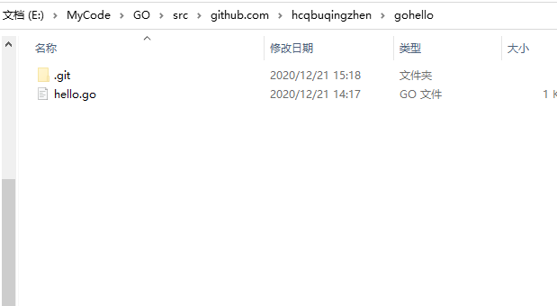

# go项目组织和入门
## 1 代码组织
### 1 工作空间
go 工具为公共代码仓库中维护的开源代码而设计。 无论你会不会公布代码，该模型设置工作环境的方法都是相同的。  

Go代码必须放在工作空间内。它其实就是一个目录，其中包含三个子目录：  
- src 目录包含Go的源文件，它们被组织成包（每个目录都对应一个包），  
- pkg 目录包含包对象，  
- bin 目录包含可执行命令。

go 工具用于构建源码包，并将其生成的二进制文件安装到 pkg 和 bin 目录中。  
src 子目录通常包会含多种版本控制的代码仓库（例如Git或Mercurial）， 以此来跟踪一个或多个源码包的开发。  
```shell
bin/
	streak                         # 可执行命令
	todo                           # 可执行命令
pkg/
	linux_amd64/
		code.google.com/p/goauth2/
			oauth.a                # 包对象
		github.com/nf/todo/
			task.a                 # 包对象
src/
	code.google.com/p/goauth2/
		.hg/                       # mercurial 代码库元数据
		oauth/
			oauth.go               # 包源码
			oauth_test.go          # 测试源码
	github.com/nf/
		streak/
		.git/                      # git 代码库元数据
			oauth.go               # 命令源码
			streak.go              # 命令源码
		todo/
		.git/                      # git 代码库元数据
			task/
				task.go            # 包源码
			todo.go                # 命令源码
```
此工作空间包含三个代码库（goauth2、streak 和 todo），两个命令（streak 和 todo） 以及两个库（oauth 和 task）。

命令和库从不同的源码包编译而来。稍后我们会对讨论它的特性。  
### 2 GOPATH 环境变量
GOPATH 环境变量指定了你的工作空间位置。它或许是你在开发Go代码时， 唯一需要设置的环境变量。

首先创建一个工作空间目录，并设置相应的 GOPATH。你的工作空间可以放在任何地方， 在此文档中我们使用 $HOME/work。注意，它绝对不能和你的Go安装目录相同。 （另一种常见的设置是 GOPATH=$HOME。）
```shell
$ mkdir $HOME/work
$ export GOPATH=$HOME/work
```
作为约定，请将此工作空间的 bin 子目录添加到你的 PATH 中：
```shell
$ export PATH=$PATH:$GOPATH/bin
```
### 3 包路径

**标准库**中的包有给定的短路径，比如 `"fmt"` 和 `"net/http"`。 对于你自己的包，你必须选择一个基本路径，来保证它不会与将来添加到标准库， 或其它扩展库中的包相冲突。

如果你将你的代码放到了某处的源码库，那就应当使用该源码库的根目录作为你的基本路径。 例如，若你在 [GitHub](https://github.com/) 上有账户 **`github.com/user`** 那么它就应该是你的**基本路径**。

注意，在你能构建这些代码之前，无需将其公布到远程代码库上。只是若你某天会发布它， 这会是个好习惯。在实践中，你可以选择任何路径名，只要它对于标准库和更大的Go生态系统来说， 是唯一的就行。

我们将使用 `github.com/user` 作为基本路径。在你的工作空间里创建一个目录， 我们将源码存放到其中：

```shell
$ mkdir -p $GOPATH/src/github.com/user
```



如上图 gohello是项目库hcqbuqingzhen里的一个项目.  

### 4 包名

Go源文件中的第一个语句必须是

```shell
package 名称
```

这里的 **名称** 即为导入该包时使用的默认名称。 （**一个包中的所有文件都必须使用相同的包名**。）

Go的约定是包名为导入路径的最后一个元素：作为 “`crypto/rot13`” 导入的包应命名为 `rot13`。

即约定**包名为文件路径最后一个文件夹**

**可执行命令必须使用 package main**。

链接成单个二进制文件的所有包，其包名无需是唯一的，只有导入路径（它们的完整文件名） 才是唯一的。

关于导包 只需导入包文件源码所在的目录,一个文件夹下只能有一个包名.


## 2 组织案例

### 1 你的第一个程序

要编译并运行简单的程序，首先要选择包路径（我们在这里使用 `github.com/hcqbuqingzhen/gohello`），并在你的工作空间内创建相应的包目录：

```shell
$ mkdir $GOPATH/src/github.com/hcqbuqingzhen/gohello
```

接着，在该目录中创建名为 `hello.go` 的文件，其内容为以下Go代码：

```shell
package main

import "fmt"

func main() {
	fmt.Printf("Hello, world.\n")
}
```

现在你可以用 `go` 工具构建并安装此程序了：

```shell
$ go install github.com/hcqbuqingzhen/gohello
```

注意，你可以在系统的任何地方运行此命令。`go` 工具会根据 `GOPATH` 指定的工作空间，在 `github.com/user/hello` 包内查找源码。

若在从包目录中运行 `go install`，也可以省略包路径：

```shell
$ cd $GOPATH/src/github.com/hcqbuqingzhen/gohello
$ go install
```

此命令会构建 `hello` 命令，产生一个可执行的二进制文件。 接着它会将该二进制文件作为 `hello`（在 Windows 下则为 `hello.exe`）安装到工作空间的 `bin` 目录中。 在我们的例子中为 `$GOPATH/bin/gohello`，具体一点就是 `$HOME/go/bin/gohello`。

`go` 工具只有在发生错误时才会打印输出，因此若这些命令没有产生输出， 就表明执行成功了。

现在，你可以在命令行下输入它的完整路径来运行它了：

```shell
$ $GOPATH/bin/gohello
Hello, world.
```

若你已经将 `$GOPATH/bin` 添加到 `PATH` 中了，只需输入该二进制文件名即可：

```shell
$ hello
Hello, world.
```

若你使用源码控制系统，那现在就该初始化仓库，添加文件并提交你的第一次更改了。 再次强调，这一步是可选的：你无需使用源码控制来编写Go代码。

```shell
$ cd $GOPATH/src/github.com/hcqbuqingzhen/gohello
$ git init
Initialized empty Git repository in GO/src/github.com/hcqbuqingzhen/gohello/.git/
$ git add hello.go
$ git commit -m "initial commit"
[master (root-commit) 0b4507d] initial commit
 1 file changed, 1 insertion(+)
  create mode 100644 hello.go
```

将代码推送到远程仓库就留作读者的练习了。

### 2 你的第一个库

让我们编写一个库，并让 `hello` 程序来使用它。


同样，第一步还是选择包路径（我们将使用 `github.com/user/stringutil`） 并创建包目录：

```shell
$ mkdir $GOPATH/src/github.com/user/stringutil
```

接着，在该目录中创建名为 `reverse.go` 的文件，内容如下：

```go
// stringutil 包含有用于处理字符串的工具函数。
package stringutil

// Reverse 将其实参字符串以符文为单位左右反转。
func Reverse(s string) string {
	r := []rune(s)
	for i, j := 0, len(r)-1; i < len(r)/2; i, j = i+1, j-1 {
		r[i], r[j] = r[j], r[i]
	}
	return string(r)
}
```

现在用 `go build` 命令来测试该包的编译：

```shell
$ go build github.com/user/stringutil
```

当然，若你在该包的源码目录中，只需执行：

```shell
$ go build
```

即可。这不会产生输出文件。想要输出的话，必须使用 `go install` 命令，它会将包的对象放到工作空间的 `pkg` 目录中。

确认 `stringutil` 包构建完毕后，修改原来的 `hello.go` 文件（它位于 `$GOPATH/src/github.com/user/hello`）去使用它：

```go
package main

import (
	"fmt"

	"github.com/user/stringutil"
)

func main() {
	fmt.Printf(stringutil.Reverse("!oG ,olleH"))
}
```

无论是安装包还是二进制文件，`go` 工具都会安装它所依赖的任何东西。 因此当我们通过

```shell
$ go install github.com/user/hello
```

来安装 `hello` 程序时，`stringutil` 包也会被自动安装。

运行此程序的新版本，你应该能看到一条新的，反向的信息：

```shell
$ hello
Hello, Go!
```

做完上面这些步骤后，你的工作空间应该是这样的：

```shell
bin/
	hello                 # 可执行命令
pkg/
	linux_amd64/          # 这里会反映出你的操作系统和架构
		github.com/user/
			stringutil.a  # 包对象
src/
	github.com/user/
		hello/
			hello.go      # 命令源码
		stringutil/
			reverse.go       # 包源码
```

注意 `go install` 会将 `stringutil.a` 对象放到 `pkg/linux_amd64` 目录中，它会反映出其源码目录。 这就是在此之后调用 `go` 工具，能找到包对象并避免不必要的重新编译的原因。 `linux_amd64` 这部分能帮助跨平台编译，并反映出你的操作系统和架构。

Go的可执行命令是静态链接的；在运行Go程序时，包对象无需存在。


## 3 其他

### 1 测试

Go拥有一个轻量级的测试框架，它由 `go test` 命令和 `testing` 包构成。

你可以通过创建一个名字以 `_test.go` 结尾的，包含名为 `TestXXX` 且签名为 `func (t *testing.T)` 函数的文件来编写测试。 测试框架会运行每一个这样的函数；若该函数调用了像 `t.Error` 或 `t.Fail` 这样表示失败的函数，此测试即表示失败。

我们可通过创建文件 `$GOPATH/src/github.com/user/stringutil/reverse_test.go` 来为 `stringutil` 添加测试，其内容如下：

```go
package stringutil

import "testing"

func TestReverse(t *testing.T) {
	cases := []struct {
		in, want string
	}{
		{"Hello, world", "dlrow ,olleH"},
		{"Hello, 世界", "界世 ,olleH"},
		{"", ""},
	}
	for _, c := range cases {
		got := Reverse(c.in)
		if got != c.want {
			t.Errorf("Reverse(%q) == %q, want %q", c.in, got, c.want)
		}
	}
}
```

接着使用 `go test` 运行该测试：

```shell
$ go test github.com/user/stringutil
ok  	github.com/user/stringutil 0.165s
```

同样，若你在包目录下运行 `go` 工具，也可以忽略包路径

```shell
$ go test
ok  	github.com/user/stringutil 0.165s
```


### 2 远程包

像Git或Mercurial这样的版本控制系统，可根据导入路径的描述来获取包源代码。`go` 工具可通过此特性来从远程代码库自动获取包。例如，本文档中描述的例子也可存放到Google Code上的Mercurial仓库 `code.google.com/p/go.example` 中，若你在包的导入路径中包含了代码仓库的URL，`go get` 就会自动地获取、 构建并安装它：

```shell
$ go get github.com/golang/example/hello
$ $GOPATH/bin/hello
Hello, Go examples!
```

若指定的包不在工作空间中，`go get` 就会将会将它放到 `GOPATH` 指定的第一个工作空间内。（若该包已存在，`go get` 就会跳过远程获取， 其行为与 `go install` 相同）

在执行完上面的`go get` 命令后，工作空间的目录树看起来应该是这样的：

```shell
bin/
	hello                 # 可执行命令
pkg/
	linux_amd64/
		code.google.com/p/go.example/
			stringutil.a     # 包对象
		github.com/user/
			stringutil.a     # 包对象
src/
	code.google.com/p/go.example/
		hello/
			hello.go      # 命令源码
		stringutil/
			reverse.go       # 包源码
			reverse_test.go  # 测试源码
	github.com/user/
		hello/
			hello.go      # 命令源码
		stringutil/
			reverse.go       # 包源码
			reverse_test.go  # 测试源码
```

`hello` 命令及其依赖的 `stringutil` 包都托管在Google Code上的同一代码库中。`hello.go` 文件使用了同样的导入路径约定， 因此 `go get` 命令也能够定位并安装其依赖包。

```shell
import "github.com/golang/example/stringutil"
```

遵循此约定可让他人以最简单的方式使用你的Go包。 [Go维基](http://code.google.com/p/go-wiki/wiki/Projects) 与 [godoc.org](http://godoc.org/) 提供了外部Go项目的列表。