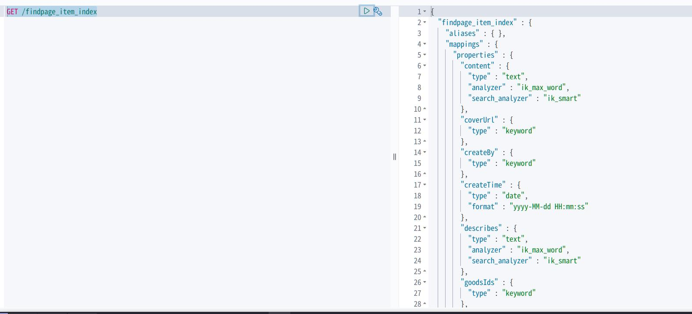
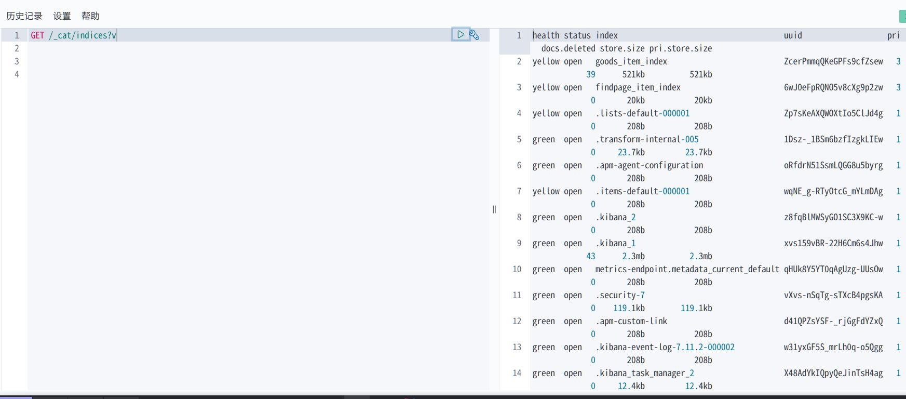
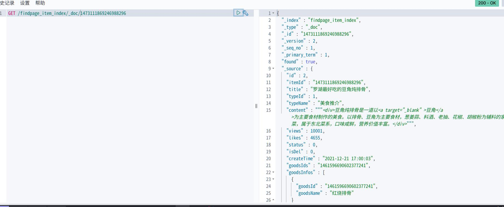

## es02-es的概念-索引和文档
es的安装在很久之前的文章已经完成，这里不再讲述。
这节将涉及index、type、document的增删查改相关的内容。
index就像sql中的库，type可以理解为类型，7.0以上的es已经不用type了，document就像sql中的表。
### 索引 index
#### 创建索引
```java
// 语法：
PUT /索引名
{
    index的配置（primary shard的数量等）
}
```
例子
```json
// 例子（带配置信息的话以配置信息创建）【请不要复制这个注释！】
PUT /product
{
    "settings":{
        "index":{
            "number_of_shards":3,
            "number_of_replicas":1
          }
     }
}
```

在上述的例子中：number_of_shards是主分片的数量；number_of_replicas是副本分片的数量(这里提一下，number_of_replicas副本分片的数量是面向主分片的，所以这个值为1时代表每一个主分片有一个副本分片)。

在插入一个文档的时候，如果index还没有创建，那么会自动创建，这时候index的一些配置会采用默认的配置，默认的主分片数量是5，副本分片数量是1

#### 查看索引
1. 查看单个索引
语法：GET /索引名
效果：返回指定索引的信息



- mappings：是索引中存储的数据的结构信息，由于上图的索引product中并没有存储document，而且我们也没有指定，所以也为空。mappings定义了文档的字段的数据类型和搜索策略等信息。
- settings：索引的配置信息

2. 查看所有索引
命令：GET /_cat/indices?v 


#### 删除索引
语法：DELETE /索引名【支持同时删除多个索引，以逗号分割，如DELETE /testindex1,testindex2】
语法例子：DELETE /product
返回结果：【当acknowledged为true的时候代表删除成功

#### 修改索引
修改索引主要是修改分片数量、mapping、分词器，由于mapping和分词器。
如下，相关的maping,分词器后面会涉及到。
```json
PUT /product/_settings
{
  "index":{
    "number_of_replicas":2
  }
}
```
#### 关闭索引
关闭索引是为了避免修改索引的配置时他人进行文档读写。关闭索引后，就只能获取索引的配置信息，而不能读写索引中的document。有时候也用于关闭一些无用的索引来减少资源消耗。

关闭索引：POST /索引名/_close
打开索引：POST /索引名/_open

#### 索引别名

- 增加索引别名

```json
POST /_aliases
{
    "actions":[
        {
            "add":{
                "index":"索引名",
                "alias":"索引别名"
            }
        }
    ]
}
```

- 查看索引别名
方法一：通过查看索引来查看索引别名:GET /product
方式二：通过命令GET /product/_alias

- 删除索引别名

```json
POST /_aliases
{
    "actions":[
        {
            "remove":{
                "index":"索引名",
                "alias":"索引别名"
            }
        }
    ]
}
```
actions里面是一个数组，所以你是可以同时进行多个操作的

> 有很多关于index的配置。由于也是一个比较大的知识点（需要一些前置知识，单独在这里讲的话会很空白），将会单独列出来。
> index有个mapping配置，mapping定义整体的index的document的结构，和影响分词策略。由于会影响搜索，所以把这个归为搜索的分支知识点，将留到搜索篇再谈。

### 类型 type
类型type也是用于存储document的逻辑结构，相对于index来说，type是index的下级，所以通常在面向有实际意义的数据时，index作为大类的划分，type作为小类的划分。比如如果把book书作为一个大类来建立index的话，那么书的类型(小说类、文学类、IT技术类等)就可以作为type。  

如果type的字段差别太大，那么就会导致mapping需要存储的字段过多。ElasticSearch维护组织后面发现这多个type的情况确实有点烦人。于是他们准备让一个index只放一个type了，在6.x版本中，一个索引下只有一个type，如果声明多个type，会被标记为过期，但是仍可以使用。7.0之后的版本将完全移除

### 文档 document
- 文档的格式是json式的。
对于文档，有几个主要的标识信息：_index(插入到哪个索引中),_type(插入到哪个类型中),_id(文档的id是多少)，在插入一个文档的时候，这几个信息也是必须的。
#### 插入文档
```json
PUT /index/type/id
json格式的数据
```
例子
```json
PUT /douban/book/4
{
	"book_id":4,
	"book_name":"Other Voices, Other Rooms",
	"book_author":"Truman Capote",
	"book_pages":240,
	"book_express":"Vintage",
	"publish_date":"1994-02-01",
	"book_summary":"""
  Truman Capote’s first novel is a story of almost supernatural intensity and inventiveness, an audacious foray into the mind of a sensitive boy as he seeks out the grown-up enigmas of love and death in the ghostly landscape of the deep South.
  
  At the age of twelve, Joel Knox is summoned to meet the father who abandoned him at birth. But when Joel arrives at the decaying mansion in Skully’s Landing, his father is nowhere in sight. What he finds instead is a sullen stepmother who delights in killing birds; an uncle with the face—and heart—of a debauched child; and a fearsome little girl named Idabel who may offer him the closest thing he has ever known to love."""
}
```

#### 查询指定文档
后面要单独讲查询的类型son
```json
GET /index/type/id
```
例子
```json
GET /findpage_item_index/_doc/1473111869246988296
```

#### 更新文档
```json
// 全替换(覆盖)式更新：会使用新的json数据直接覆盖原有的【请不要复制注释】
PUT /index/type/id
json数据

// 部分替换式更新：只会覆盖指定数据
POST /index/type/id/_update
{
  "doc": {
    "需要修改的字段": "修改值"
    [,"需要修改的字段": "修改值"]
  }
}
```
例子
```json
【全替换语句与插入差不多，所以不举例了】

POST /douban/book/4/_update
{
  "doc": {
    "book_pages":241,
    "publish_date":"1994-02-02"
  }
}
```
#### 删除文档
DELETE /index/type/id
- 删除后可以重新执行插入语句恢复数据
  DELETE /douban/book/4

### 查询所有文档

```json

GET /index/type/_search
{
  "query":{
    "match_all": {}
  }
}
```

例子

```json
GET /douban/book/_search
{
  "query":{
    "match_all": {}
  }
}
```