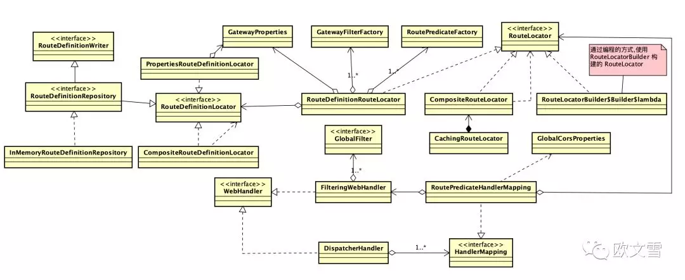

---
title: 03-spring-cloud-gateway-源码分析
date: 2021-12-07 20:21:45
tags: spring-cloud-gateway
---  
## 03-spring-cloud-gateway-源码分析

- 它们存在一个共同问题：路由配置变更后必须重启Gateway应用才能生效。这实在是不适合生产环境！
- 所以我们要实现动态路由  

> 了解原理最好的方法是读源码，因此我们可以从源码入手，了解它是如何工作的，这样知其所以然->知其如何然。可以不仅仅模仿网上的几种方法，还能实现其他的方法。 这篇文章和余下部分主要分析源码。  
### 1.启动过程
首先观察配置类，配置类生效的步骤如下。

```flow
one=>start: GatewayLoadBalancerClientAutoConfiguration
two=>operation: GatewayClassPathWarningAutoConfiguratio  
th=>operation: GatewayRedisAutoConfiguration
fo=>end: GatewayAutoConfiguration

one->two->th->fo
```

- GatewayLoadBalancerClientAutoConfiguration  

    初始化ReactiveLoadBalancerClientFilter类

- GatewayClassPathWarningAutoConfiguratio  
    用于检查项目是否正确导入 spring-boot-starter-webflux 依赖，而不是错误导入 spring-boot-starter-web 依赖。

- GatewayRedisAutoConfiguration
    初始化 RedisRateLimiter 
    RequestRateLimiterGatewayFilterFactory 基于 RedisRateLimiter 实现网关的限流功能

- GatewayAutoConfiguration 
    Spring Cloud Gateway 核心配置类  
    初始化的bean如下
    - NettyConfiguration
    - GlobalFilter
    - FilteringWebHandler
    - GatewayProperties
    - PrefixPathGatewayFilterFactory
    - RoutePredicateFactory
    - RouteDefinitionLocator
    - RouteLocator
    - RoutePredicateHandlerMapping
    - GatewayWebfluxEndpoint

1. NettyConfiguration ，Netty 配置类。  


> 1. 创建一个类型为 java.util.Objects.Consumer 的 Bean 对象。该 Consumer 会将传入类型为 reactor.ipc.netty.options.HttpClientOptions.Builder 的参数 opts ，设置 opts 的 poolResources 属性。调用 PoolResources.elastic("proxy") 方法，创建 name 属性为 "proxy" 的 reactor.ipc.netty.resources.PoolResources 。其中 "proxy" 用于实际使用时，打印日志的标记。
> 2. 创建一个类型为 reactor.ipc.netty.http.client.HttpClient 的 Bean 对象。该 HttpClient 使用 Netty 实现的 Client 。
> 3. 使用 HttpClient Bean ，创建一个类型为 org.springframework.cloud.gateway.filter.NettyRoutingFilter 的 Bean 对象。  NettyRoutingFilter 的代码实现见后文。
> 4. 创建一个类型为 org.springframework.cloud.gateway.filter.NettyWriteResponseFilter 的 Bean 对象。 NettyWriteResponseFilter 的代码实现解析见后文。
> 5. 创建一个类型为 org.springframework.web.reactive.socket.client.ReactorNettyWebSocketClient 的 Bean 对象，用于下文 WebsocketRoutingFilter 的 Bean 对象创建。

2. GlobalFilter
> 1. 创建一个类型为 org.springframework.cloud.gateway.filter.RouteToRequestUrlFilter 的 Bean 对象。
> 2. 创建一个类型为 org.springframework.cloud.gateway.filter.ForwardRoutingFilter 的 Bean 对象。
> 3. 创建一个类型为 org.springframework.web.reactive.socket.server.WebSocketService 的 Bean 对象。
> 4. 创建一个类型为 org.springframework.cloud.gateway.filter.WebsocketRoutingFilter 的 Bean 对象。

3. FilteringWebHandler
> 当所有 org.springframework.cloud.gateway.filter.GlobalFilter 初始化完成时( 包括上面的 NettyRoutingFilter / NettyWriteResponseFilter )，创建一个类型为 org.springframework.cloud.gateway.handler.FilteringWebHandler 的 Bean 对象

4. GatewayProperties
> 创建一个类型为 org.springframework.cloud.gateway.config.GatewayProperties 的 Bean 对象，用于加载配置文件配置的 RouteDefinition / FilterDefinition 。

5. PrefixPathGatewayFilterFactory
> 创建 org.springframework.cloud.gateway.filter.factory 包下的 org.springframework.cloud.gateway.filter.factory.GatewayFilterFactory 接口的实现们。

6. RoutePredicateFactory
> 创建 org.springframework.cloud.gateway.handler.predicate 包下的 org.springframework.cloud.gateway.handler.predicate.RoutePredicateFactory 接口的实现们。 

7. RouteDefinitionLocator (3.0.x 版本 改为直接注入下面几个对象)
> 1. 使用 GatewayProperties Bean ，创建一个类型为 org.springframework.cloud.gateway.config.PropertiesRouteDefinitionLocator 的 Bean 对象。
> 2. 创建一个类型为 org.springframework.cloud.gateway.route.InMemoryRouteDefinitionRepository 的 Bean 对象。
> 3. 使用上面创建的 RouteDefinitionLocator 的 Bean 对象们，创建一个类型为 org.springframework.cloud.gateway.route.CompositeRouteDefinitionLocator 的 Bean 对象。

8. RouteLocator
> 1. 创建一个类型为 org.springframework.cloud.gateway.route.RouteDefinitionRouteLocator 的 Bean 对象。
此处的 routeDefinitionLocator 参数，使用了 @Primary 注解的 CompositeRouteDefinitionLocator 的 Bean 对象。
> 2. 创建一个类型为 org.springframework.cloud.gateway.route.CachingRouteLocator 的 Bean 对象。该 Bean 对象内嵌 org.springframework.cloud.gateway.route.CompositeRouteLocator 对象。
 
9. RoutePredicateHandlerMapping 
> 创建一个类型为 org.springframework.cloud.gateway.handler.RoutePredicateHandlerMapping 的 Bean 对象，用于查找匹配到 Route ，并进行处理。

10. GatewayWebfluxEndpoint
> 创建一个类型为 org.springframework.cloud.gateway.actuate.GatewayWebfluxEndpoint 的 Bean 对象，提供管理网关的 HTTP API .


### 2.核心组件和工作原理
#### 2.1.基本组件
1. Route  

 ```java
    private final String id;  

	private final URI uri;

	private final int order;

	private final AsyncPredicate<ServerWebExchange> predicate;

	private final List<GatewayFilter> gatewayFilters;

	private final Map<String, Object> metadata;
```

   >1. id，标识符，区别于其他 Route。  
   >2. destination uri，路由指向的目的地 uri，即客户端请求最终被转发的目的地。
   >3. order，用于多个 Route 之间的排序，数值越小排序越靠前，匹配优先级越高。
   >4. predicate，谓语，表示匹配该 Route 的前置条件，即满足相应的条件才会被路由到目的地 uri。
   >5. gateway filters，过滤器用于处理切面逻辑，如路由转发前修改请求头等。  


2. AsyncPredicate  
```java
public interface AsyncPredicate<T> extends Function<T, Publisher<Boolean>> {

	default AsyncPredicate<T> and(AsyncPredicate<? super T> other) {
		return new AndAsyncPredicate<>(this, other);
	}

	default AsyncPredicate<T> negate() {
		return new NegateAsyncPredicate<>(this);
	}

	default AsyncPredicate<T> not(AsyncPredicate<? super T> other) {
		return new NegateAsyncPredicate<>(other);
	}

	default AsyncPredicate<T> or(AsyncPredicate<? super T> other) {
		return new OrAsyncPredicate<>(this, other);
	}
...
}
```
AsyncPredicate 定义了 4 种逻辑操作方法：

> 1. and ，与操作，即两个 Predicate 组成一个，需要同时满足。
> 2. negate，取反操作，即对 Predicate 匹配结果取反。
> 3. or，或操作，即两个 Predicate 组成一个，只需满足其一。
> 4. not和其他的不同

3. GatewayFilter

```java
public interface GatewayFilter extends ShortcutConfigurable {

	/**
	 * Name key.
	 */
	String NAME_KEY = "name";

	/**
	 * Value key.
	 */
	String VALUE_KEY = "value";

	/**
	 * Process the Web request and (optionally) delegate to the next {@code WebFilter}
	 * through the given {@link GatewayFilterChain}.
	 * @param exchange the current server exchange
	 * @param chain provides a way to delegate to the next filter
	 * @return {@code Mono<Void>} to indicate when request processing is complete
	 */
	Mono<Void> filter(ServerWebExchange exchange, GatewayFilterChain chain);

}
```

#### 2.2 Route 构建的原理
外部化配置是如何工作的？    
Spring boot 遵循规约大于配置的原则，starter 模块都有对应的以模块名称作前缀，以 “AutoConfiguration” 后缀的自动装配类。同样的还有以模块名前缀，以Properties后缀的配置类作为支持。  
Gateway 模块自动装配类为 GatewayAutoConfiguration，对应的配置类为 GatewayProperties。  
1. GatewayProperties。
```java
	/**
	 * List of Routes.
	 */
	@NotNull
	@Valid
	private List<RouteDefinition> routes = new ArrayList<>();

	/**
	 * List of filter definitions that are applied to every route.
	 */
	private List<FilterDefinition> defaultFilters = new ArrayList<>();
```
- 表明以 “spring.cloud.gateway” 前缀的 properties 会绑定 GatewayProperties。
- 用来对 Route 进行定义。
- 用于定义默认的 Filter 列表，默认的 Filter 会应用到每一个 Route 上，gateway 处理时会将其与 Route 中指定的 Filter 进行合并后并逐个执行。

2. RouteDefinition
```java
    private String id;

	@NotEmpty
	@Valid
	private List<PredicateDefinition> predicates = new ArrayList<>();

	@Valid
	private List<FilterDefinition> filters = new ArrayList<>();

	@NotNull
	private URI uri;

	private Map<String, Object> metadata = new HashMap<>();

	private int order = 0;
```

- 定义 Route 的 id，2.x默认使用 UUID。3.x默认为0
- 定义 Predicate。
- 定义 Filter。
- 定义目的地 URI。
- 定义 Route 的序号。

3. FilterDefinition

```java
@NotNull
	private String name;

	private Map<String, String> args = new LinkedHashMap<>();

	public FilterDefinition() {
	}
```
- 定义了 Filter 的名称，符合特定的命名规范，为对应的工厂名前缀。
- 一个键值对参数用于构造 Filter 对象

4. PredicateDefinition
```java
@NotNull
	private String name;

	private Map<String, String> args = new LinkedHashMap<>();

	public PredicateDefinition() {
	}

	public PredicateDefinition(String text) {
		int eqIdx = text.indexOf('=');
		if (eqIdx <= 0) {
			throw new ValidationException(
					"Unable to parse PredicateDefinition text '" + text + "'" + ", must be of the form name=value");
		}
		setName(text.substring(0, eqIdx));

		String[] args = tokenizeToStringArray(text.substring(eqIdx + 1), ",");

		for (int i = 0; i < args.length; i++) {
			this.args.put(NameUtils.generateName(i), args[i]);
		}
	}

```

- 定义了 Predicate 的名称，它们要符固定的命名规范，为对应的工厂名称。
- 一个 Map 类型的参数，构造 Predicate 使用到的键值对参数。

5. RoutePredicateFactory  

```java

@FunctionalInterface // ①
public interface RoutePredicateFactory<C> extends ShortcutConfigurable,
    Configurable<C> { // ④

    Predicate<ServerWebExchange> apply(C config); // ②

    default AsyncPredicate<ServerWebExchange> applyAsync(C config) { // ③
        return toAsyncPredicate(apply(config));
    }
}
// RoutePredicateFactory 扩展了 Configurable
public interface Configurable<C> {
    Class<C> getConfigClass();  // ⑤
    C newConfig(); // ⑥
}
```

- 声明它是一个函数接口。
- 核心方法，即函数接口的唯一抽象方法，用于生产 Predicate，接收一个范型参数 config。
- 对参数 config 应用工厂方法，并将返回结果 Predicate 包装成 AsyncPredicate。包装成 AsyncPredicate 是为了使用非阻塞模型。
- 扩展了 Configurable 接口，从命名上可以推断 Predicate 工厂是支持配置的。
- 获取配置类的类型，支持范型，具体的 config 类型由子类指定。
- 创建一个 config 实例，由具体的实现类来完成。

6. GatewayFilterFactory

```java

	// useful for javadsl
	default GatewayFilter apply(String routeId, Consumer<C> consumer) {
		C config = newConfig();
		consumer.accept(config);
		return apply(routeId, config);
	}

	default GatewayFilter apply(Consumer<C> consumer) {
		C config = newConfig();
		consumer.accept(config);
		return apply(config);
	}
```
- GatewayFilterFactory 职责就是生产 GatewayFilter。
- 同样继承了 ShortcutConfigurable 和 Configurable 接口，支持配置。
- 核心方法，用于生产 GatewayFilter，接收一个范型参数 config 。

#### 2.3 Predicate 示例
主要是观察一个Predicate是如何被读取的。  

```yml
spring:
  cloud:
    gateway:
      discovery:
        locator:
          lowerCaseServiceId: true
          enabled: true
      routes:
        - id: admin-api
          uri: lb://rrs-admin-api
          predicates:
            - Path=/admin-api/**
          filters:
            - StripPrefix=1
```
那么生成的 PredicateDefinition 对象 toString() 方法返回结果  
> PredicateDefinition {
    name='Path',
    args={_genkey_0=/admin-api/**]}
}

1. 生产谓语的工厂
```java
public class PathRoutePredicateFactory extends AbstractRoutePredicateFactory<PathRoutePredicateFactory.Config> {

	private static final Log log = LogFactory.getLog(PathRoutePredicateFactory.class);

	private static final String MATCH_TRAILING_SLASH = "matchTrailingSlash";

	private PathPatternParser pathPatternParser = new PathPatternParser();

	public PathRoutePredicateFactory() {
		super(Config.class);
	}

	private static void traceMatch(String prefix, Object desired, Object actual, boolean match) {
		if (log.isTraceEnabled()) {
			String message = String.format("%s \"%s\" %s against value \"%s\"", prefix, desired,
					match ? "matches" : "does not match", actual);
			log.trace(message);
		}
	}

	public void setPathPatternParser(PathPatternParser pathPatternParser) {
		this.pathPatternParser = pathPatternParser;
	}

	@Override
	public List<String> shortcutFieldOrder() {
		return Arrays.asList("patterns", MATCH_TRAILING_SLASH);
	}

	@Override
	public ShortcutType shortcutType() {
		return ShortcutType.GATHER_LIST_TAIL_FLAG;
	}

	@Override
	public Predicate<ServerWebExchange> apply(Config config) {  //1
		final ArrayList<PathPattern> pathPatterns = new ArrayList<>();
		synchronized (this.pathPatternParser) {
			pathPatternParser.setMatchOptionalTrailingSeparator(config.isMatchTrailingSlash());
			config.getPatterns().forEach(pattern -> {
				PathPattern pathPattern = this.pathPatternParser.parse(pattern);
				pathPatterns.add(pathPattern);
			});
		}
		return new GatewayPredicate() {
			@Override
			public boolean test(ServerWebExchange exchange) {
				PathContainer path = parsePath(exchange.getRequest().getURI().getRawPath());

				PathPattern match = null;
				for (int i = 0; i < pathPatterns.size(); i++) {
					PathPattern pathPattern = pathPatterns.get(i);
					if (pathPattern.matches(path)) {
						match = pathPattern;
						break;
					}
				}

				if (match != null) {
					traceMatch("Pattern", match.getPatternString(), path, true);
					PathMatchInfo pathMatchInfo = match.matchAndExtract(path);
					putUriTemplateVariables(exchange, pathMatchInfo.getUriVariables());
					exchange.getAttributes().put(GATEWAY_PREDICATE_MATCHED_PATH_ATTR, match.getPatternString());
					String routeId = (String) exchange.getAttributes().get(GATEWAY_PREDICATE_ROUTE_ATTR);
					if (routeId != null) {
						// populated in RoutePredicateHandlerMapping
						exchange.getAttributes().put(GATEWAY_PREDICATE_MATCHED_PATH_ROUTE_ID_ATTR, routeId);
					}
					return true;
				}
				else {
					traceMatch("Pattern", config.getPatterns(), path, false);
					return false;
				}
			}

			@Override
			public String toString() {
				return String.format("Paths: %s, match trailing slash: %b", config.getPatterns(),
						config.isMatchTrailingSlash());
			}
		};
	}
```

>1. 返回一个GatewayPredicate 对象，test方法返回true则通过，请求可以按这个规则走。
>2. PredicateDefinition 对象又是如何转换成 PathRoutePredicateFactory.Config 对象的？
>3. 这要涉及 RouteLocator 组件。

2. RouteLocator
Route 的定位器或者说探测器，是用来获取 Route 信息的。
外部化配置定义 Route 使用的是 RouteDefinition 组件。同样的也有配套的 RouteDefinitionLocator 组件。

RouteLocator 
```java
public interface RouteLocator {
    Flux<Route> getRoutes(); // ①
}
```
RouteDefinitionLocator
```java
public interface RouteDefinitionLocator {
    Flux<RouteDefinition> getRouteDefinitions(); // ①
}
```

3. RouteDefinitionRouteLocator
   RouteLocator 最主要的实现类，用于将 RouteDefinition 转换成 Route。
```java
public class RouteDefinitionRouteLocator implements RouteLocator {

	/**
	 * Default filters name.
	 */
	public static final String DEFAULT_FILTERS = "defaultFilters";

	protected final Log logger = LogFactory.getLog(getClass());

	private final RouteDefinitionLocator routeDefinitionLocator;

	private final ConfigurationService configurationService;

	private final Map<String, RoutePredicateFactory> predicates = new LinkedHashMap<>();

	private final Map<String, GatewayFilterFactory> gatewayFilterFactories = new HashMap<>();

	private final GatewayProperties gatewayProperties;

	public RouteDefinitionRouteLocator(RouteDefinitionLocator routeDefinitionLocator, //1
			List<RoutePredicateFactory> predicates, //2
			List<GatewayFilterFactory> gatewayFilterFactories,//3
			GatewayProperties gatewayProperties, //4
			ConfigurationService configurationService) { //5
		this.routeDefinitionLocator = routeDefinitionLocator;
		this.configurationService = configurationService;
		initFactories(predicates);
		gatewayFilterFactories.forEach(factory -> this.gatewayFilterFactories.put(factory.name(), factory));
		this.gatewayProperties = gatewayProperties;
	}

...
}
```
>1. routeDefinitionLocator 用于加载外部配置的RouteDefinitionLocator类
>2. List<RoutePredicateFactory> predicates 加载谓语的工厂集合 
>3. gatewayFilterFactories ,加载过滤器的工厂集合 
>4. GatewayProperties gatewayProperties ,外部化配置类。
>5. ConfigurationService configurationService ，是一个用来

该类依赖 GatewayProperties 对象，后者已经携带了 List 结构的 RouteDefinition，那为什么还要依赖 RouteDefinitionLocator 来提供 RouteDefinition？
>1. 这里并不会直接使用到 GatewayProperties 类中的 RouteDefinition，仅是用到其定义的 default filters，这会应用到每一个 Route 上。
>2. 最终传入的 RouteDefinitionLocator 实现上是 CompositeRouteDefinitionLocator 的实例，它组合了 GatewayProperties 中所定义的 routes。

在自动装配类中
```java

	@Bean
	@ConditionalOnMissingBean
	public PropertiesRouteDefinitionLocator propertiesRouteDefinitionLocator(GatewayProperties properties) {1
		return new PropertiesRouteDefinitionLocator(properties);//1
	}

	@Bean
	@ConditionalOnMissingBean(RouteDefinitionRepository.class)
	public InMemoryRouteDefinitionRepository inMemoryRouteDefinitionRepository() {
		return new InMemoryRouteDefinitionRepository();
	}

	@Bean
	@Primary
	public RouteDefinitionLocator routeDefinitionLocator(List<RouteDefinitionLocator> routeDefinitionLocators) {
		return new CompositeRouteDefinitionLocator(Flux.fromIterable(routeDefinitionLocators));//2
	}
```
>1. 是RouteDefinitionLocator 的实现类，RouteDefinition 信息来自 GatewayProperties。
>2. 使用 CompositeRouteDefinitionLocator 实现，它组合了多个 RouteDefinitionLocator 实例。这给用户（开发者）提供了可扩展的余地，用户可以根据需要扩展自己的 RouteDefinitionLocator，比如 RouteDefinition 可源自数据库。  

**比如 RouteDefinition 可源自数据库。**
**这里就可以实现动态路由**
- 一种是主动触发，更新路由，路由可以在数据库中，也可以在各种缓存中，也可以在直接返回一个文本文件。
- 二是事件触发，例如当nacos配置更新，自动更新路由。甚至自己写事件，当数据库特定表更新则更新路由。

**RouteDefinitionRouteLocator核心方法**
```java
	@Override
	public Flux<Route> getRoutes() {
		Flux<Route> routes = this.routeDefinitionLocator.getRouteDefinitions().map(this::convertToRoute);//1

		if (!gatewayProperties.isFailOnRouteDefinitionError()) {
			// instead of letting error bubble up, continue
			routes = routes.onErrorContinue((error, obj) -> {
				if (logger.isWarnEnabled()) {
					logger.warn("RouteDefinition id " + ((RouteDefinition) obj).getId()
							+ " will be ignored. Definition has invalid configs, " + error.getMessage());
				}
			});
		}

		return routes.map(route -> {
			if (logger.isDebugEnabled()) {
				logger.debug("RouteDefinition matched: " + route.getId());
			}
			return route;
		});
	}

	private Route convertToRoute(RouteDefinition routeDefinition) { //2
		AsyncPredicate<ServerWebExchange> predicate = combinePredicates(routeDefinition);
		List<GatewayFilter> gatewayFilters = getFilters(routeDefinition);//3

		return Route.async(routeDefinition).asyncPredicate(predicate).replaceFilters(gatewayFilters).build();//4
	}
```
>1. 调用 convertToRoute 方法将 RouteDefinition 转换成 Route。
>2. 将 PredicateDefinition 转换成 AsyncPredicate。
>3. 将 FilterDefinition 转换成 GatewayFilter。
>4. 根据 ② 和 ③ 两步骤定义的变量生成 Route 对象。

- PredicateDefinition 转换成 AsyncPredicate
```java
private AsyncPredicate<ServerWebExchange> combinePredicates(RouteDefinition routeDefinition) {
		List<PredicateDefinition> predicates = routeDefinition.getPredicates();
		if (predicates == null || predicates.isEmpty()) {
			// this is a very rare case, but possible, just match all
			return AsyncPredicate.from(exchange -> true);
		}
		AsyncPredicate<ServerWebExchange> predicate = lookup(routeDefinition, predicates.get(0));//1

		for (PredicateDefinition andPredicate : predicates.subList(1, predicates.size())) {
			AsyncPredicate<ServerWebExchange> found = lookup(routeDefinition, andPredicate);//2
			predicate = predicate.and(found);//3
		}

		return predicate;
	}
```
>1. 调用 lookup 方法，将列表中第一个 PredicateDefinition 转换成 AsyncPredicate。
>2. 循环调用，将列表中每一个 PredicateDefinition 都转换成 AsyncPredicate。  
>3. 应用and操作，将所有的 AsyncPredicate 组合成一个 AsyncPredicate 对象。 

- PredicateDefinition 都转换成 AsyncPredicate。过程
```java

private AsyncPredicate<ServerWebExchange> lookup(RouteDefinition route, PredicateDefinition predicate) {
		RoutePredicateFactory<Object> factory = this.predicates.get(predicate.getName());//1
		if (factory == null) {
			throw new IllegalArgumentException("Unable to find RoutePredicateFactory with name " + predicate.getName());
		}
		if (logger.isDebugEnabled()) {
			logger.debug("RouteDefinition " + route.getId() + " applying " + predicate.getArgs() + " to "
					+ predicate.getName());
		}

		// @formatter:off
		Object config = this.configurationService.with(factory)
				.name(predicate.getName())
				.properties(predicate.getArgs())
				.eventFunction((bound, properties) -> new PredicateArgsEvent(
						RouteDefinitionRouteLocator.this, route.getId(), properties))
				.bind();//2
		// @formatter:on

		return factory.applyAsync(config);//3
	}
```
**这是3.0.x的代码，和2.0版本的有些不同，但大致上变化不大。**
>1. 根据 predicate 名称获取对应的 predicate factory。
>2. 创建一个 config 类对象,产生的参数绑定到 config 对象上。
>3. 将 cofing 作参数代入，调用 factory 的 applyAsync 方法创建 AsyncPredicate 对象。

- FilterDefinition 转换成 GatewayFilter

```java
	private List<GatewayFilter> getFilters(RouteDefinition routeDefinition) {
		List<GatewayFilter> filters = new ArrayList<>();

		// TODO: support option to apply defaults after route specific filters?
		if (!this.gatewayProperties.getDefaultFilters().isEmpty()) {
			filters.addAll(loadGatewayFilters(routeDefinition.getId(),
					new ArrayList<>(this.gatewayProperties.getDefaultFilters())));
		}//1

		if (!routeDefinition.getFilters().isEmpty()) {
			filters.addAll(loadGatewayFilters(routeDefinition.getId(), new ArrayList<>(routeDefinition.getFilters())));
		}//2

		AnnotationAwareOrderComparator.sort(filters);//3
		return filters;
	}
/************************************************************/
	@SuppressWarnings("unchecked")
	List<GatewayFilter> loadGatewayFilters(String id, List<FilterDefinition> filterDefinitions) {
		ArrayList<GatewayFilter> ordered = new ArrayList<>(filterDefinitions.size());
		for (int i = 0; i < filterDefinitions.size(); i++) {
			FilterDefinition definition = filterDefinitions.get(i);
			GatewayFilterFactory factory = this.gatewayFilterFactories.get(definition.getName());
			if (factory == null) {
				throw new IllegalArgumentException(
						"Unable to find GatewayFilterFactory with name " + definition.getName());
			}
			if (logger.isDebugEnabled()) {
				logger.debug("RouteDefinition " + id + " applying filter " + definition.getArgs() + " to "
						+ definition.getName());
			}

			// @formatter:off
			Object configuration = this.configurationService.with(factory)
					.name(definition.getName())
					.properties(definition.getArgs())
					.eventFunction((bound, properties) -> new FilterArgsEvent(
							// TODO: why explicit cast needed or java compile fails
							RouteDefinitionRouteLocator.this, id, (Map<String, Object>) properties))
					.bind();
			// @formatter:on

			// some filters require routeId
			// TODO: is there a better place to apply this?
			if (configuration instanceof HasRouteId) {
				HasRouteId hasRouteId = (HasRouteId) configuration;
				hasRouteId.setRouteId(id);
			}

			GatewayFilter gatewayFilter = factory.apply(configuration);
			if (gatewayFilter instanceof Ordered) {
				ordered.add(gatewayFilter);
			}
			else {
				ordered.add(new OrderedGatewayFilter(gatewayFilter, i + 1));
			}
		}

		return ordered;
	}

```

>1. 处理 GatewayProperties 中定义的默认的 FilterDefinition，转换成 GatewayFilter。
> >  转换逻辑
> >1. 根据 filter 名称获取对应的 filter factory。
> >2. 创建一个 config 类对象,产生的参数绑定到 config 对象上。
> >3. 将 cofing 作参数代入，调用 factory 的 applyAsync 方法创建 GatewayFilter 对象。
>2. 将 RouteDefinition 中定义的 FilterDefinition 转换成 GatewayFilter。
>3. 对 GatewayFilter 进行排序。

#### 小结

- RouteDefinitionRouteLocator 这是一个重要的中间类，用于将 RouteDefinition 转换成 Route。
- GatewayProperties，读取本地配置文件，并生成配置类。
> 1. spring boot 项目中，有autoconfig 会有对应的 Properties类。  
- RouteDefinitionLocator，这是一个加载路由基本信息的接口，有几个实现类。  
  - CachingRouteDefinitionLocator ,从缓存中获取路由定义。
  - DiscoveryClientRouteDefinitionLocator，从注册中心获取路由定义。
  - PropertiesRouteDefinitionLocator，从本地即GatewayProperties中获取路由定义。
  - CompositeRouteDefinitionLocator，集合了其他几个RouteDefinitionLocator的路由定义。
- RouteLocator 是一个由RouteDefinitionLocator获取**Route**的接口。有以下几个实现类。
  - CachingRouteLocator **RoutePredicateHandlerMapping** 使用 CachingRouteLocator 来获取 Route 信息。
  - CompositeRouteLocator
  - RouteDefinitionRouteLocator 就是最开始提到的类。
- RoutePredicateFactory，加载路由谓语的工厂，有很多实现类。RouteDefinitionRouteLocator使用不同的工厂，生成工厂对应的RoutePredicate。
- GatewayFilterFactory，加载过滤器的工厂。RouteDefinitionRouteLocator使用不同的工厂，生成对应的GatewayFilter。
- Route 目标路由对象，每个路由对象有谓语集合和过滤器集合，他们由RouteDefinitionRouteLocator对象中的方法，通过工厂类们转换RouteDefinition，将谓语和过滤器集合添加进去。
- RouteDefinitionRepository，是一个接口，继承RouteDefinitionLocator, RouteDefinitionWriter，常常用来实现动态路由。
  - InMemoryRouteDefinitionRepository 官方只有这一个实现类。



