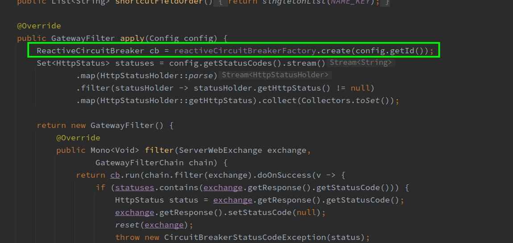
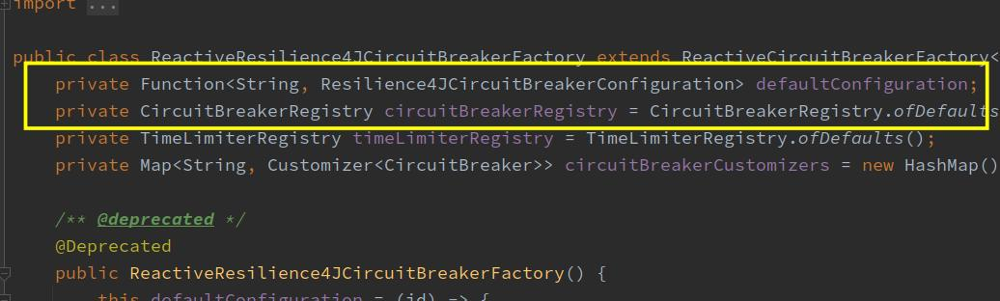
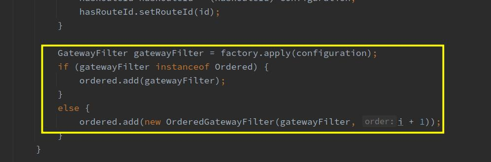

---
title: 自定义过滤器 
date: 2021-12-15 22:22:49
tags: spring-cloud-gateway
---   
# 自定义过滤器
## 自定义过滤器的基本套路
1. 新建一个类（我这里名为StatePrinterGatewayFilter.java），实现GatewayFilter和Ordered接口，重点是filter方法，该过滤器的主要功能就在这里面实现
2. 新建一个类（我这里名为StatePrinterGatewayFilterFactory.java），实现AbstractGatewayFilterFactory方法，其apply方法的返回值就是上一步新建的StatePrinterGatewayFilter的实例，该方法的入参是在路由配置中过滤器节点下面的配置，这样就可以根据配置做一些特殊的处理，然后再创建实例作为返回值
3. StatePrinterGatewayFilterFactory类实现String name()方法，该方法的返回值就是路由配置文件中过滤器的name
4. String name()也可以不实现，这是因为定义该方法的接口中有默认实现了，如下图，这样在路由配置文件中过滤器的name只能是StatePrinter： 
```java

	default String name() {
		// TODO: deal with proxys
		return NameUtils.normalizeFilterFactoryName(getClass());
	}
```
5. 在配置文件中，添加自定义的过滤器，该操作和之前的添加内置过滤器一模一样

## 2. 过滤器实现
1. 过滤器类
```java
package com.rrs.scgateway.fliter;

import io.github.resilience4j.circuitbreaker.CircuitBreaker;
import io.github.resilience4j.circuitbreaker.CircuitBreakerRegistry;
import io.vavr.collection.Seq;
import org.springframework.cloud.circuitbreaker.resilience4j.ReactiveResilience4JCircuitBreakerFactory;
import org.springframework.cloud.gateway.filter.GatewayFilter;
import org.springframework.cloud.gateway.filter.GatewayFilterChain;
import org.springframework.core.Ordered;
import org.springframework.web.server.ServerWebExchange;
import reactor.core.publisher.Mono;

import java.lang.reflect.Method;

/**
 * 自定义过滤器 打印断路器状态
 */
public class StatePrinterGatewayFilter implements GatewayFilter, Ordered {
    private ReactiveResilience4JCircuitBreakerFactory reactiveResilience4JCircuitBreakerFactory;
    private CircuitBreaker circuitBreaker = null;
    // 通过构造方法取得reactiveResilience4JCircuitBreakerFactory实例
    public StatePrinterGatewayFilter(ReactiveResilience4JCircuitBreakerFactory reactiveResilience4JCircuitBreakerFactory) {
        this.reactiveResilience4JCircuitBreakerFactory = reactiveResilience4JCircuitBreakerFactory;
    }
    @Override
    public Mono<Void> filter(ServerWebExchange exchange, GatewayFilterChain chain) {
        //反射获取CircuitBreaker
        if (null==circuitBreaker) {
            CircuitBreakerRegistry circuitBreakerRegistry = null;
            try {
                Method method = reactiveResilience4JCircuitBreakerFactory.getClass().getDeclaredMethod("getCircuitBreakerRegistry", (Class[]) null);
                // 用反射将getCircuitBreakerRegistry方法设置为可访问
                method.setAccessible(true);
                CircuitBreakerRegistry invoke = (CircuitBreakerRegistry)method.invoke(reactiveResilience4JCircuitBreakerFactory);
            }catch (Exception e){
                e.printStackTrace();
            }
            // 得到所有断路器实例
            Seq<CircuitBreaker> seq = circuitBreakerRegistry.getAllCircuitBreakers();
            // 用名字过滤，myCircuitBreaker来自路由配置中
            circuitBreaker = seq.filter(breaker -> breaker.getName().equals("myCircuitBreaker"))
                    .getOrNull();
        }
        // 取断路器状态，再判空一次，因为上面的操作未必能取到circuitBreaker
        String state = (null==circuitBreaker) ? "unknown" : circuitBreaker.getState().name();

        System.out.println("state : " + state);

        // 继续执行后面的逻辑
        return chain.filter(exchange);
    }

    @Override
    public int getOrder() {
        return 10;
    }
}

```

2. 工厂类
```java
package com.rrs.scgateway.fliter.factory;

import com.rrs.scgateway.fliter.StatePrinterGatewayFilter;
import org.springframework.beans.factory.annotation.Autowired;
import org.springframework.cloud.circuitbreaker.resilience4j.ReactiveResilience4JCircuitBreakerFactory;
import org.springframework.cloud.gateway.filter.GatewayFilter;
import org.springframework.cloud.gateway.filter.factory.AbstractGatewayFilterFactory;
import org.springframework.stereotype.Component;

/**
 * 自定义过滤器工厂类
 * 过滤器实现打印断路器状态信息
 */
@Component
public class StatePrinterGatewayFilterFactory extends AbstractGatewayFilterFactory<Object> {
    @Autowired
    ReactiveResilience4JCircuitBreakerFactory reactiveResilience4JCircuitBreakerFactory;

    @Override
    public String name() {
        return "CircuitBreakerStatePrinter";
    }

    @Override
    public GatewayFilter apply(Object config)
    {
        return new StatePrinterGatewayFilter(reactiveResilience4JCircuitBreakerFactory);
    }
}
```
3. 配置yml文件
```yml
server:
  #服务端口
  port: 8081
spring:
  application:
    name: circuitbreaker-gateway
  cloud:
    gateway:
      routes:
        - id: path_route
          uri: http://127.0.0.1:8082
          predicates:
            - Path=/hello/**
          filters:
            - name: CircuitBreaker
              args:
                name: myCircuitBreaker
            - name: CircuitBreakerStatePrinter

```

## ReactiveResilience4JCircuitBreakerFactory原理分析
- 可能会奇怪为什么要有ReactiveResilience4JCircuitBreakerFactory
- 以及ReactiveResilience4JCircuitBreakerFactory的作用

1. 在断路器实践中我们已经知道断路器是第三方库的作用，过滤器不过是个入口。
2. 在SpringCloudCircuitBreakerFilterFactory.apply方法中，可见断路器功能来自名为cb的对象，而这个对象是在红框处由reactiveCircuitBreakerFactory创建的：

3. 最终跟踪到了ReactiveResilience4JCircuitBreakerFactory类，发现了一个极其重要的变量，就是下图红框中的circuitBreakerRegistry

4. ReactiveResilience4JCircuitBreakerFactory 是一个bean,我们可以将这个bean注入我们自定义的过滤器，通过反射获取circuitBreakerRegistry。

## 3.一个问题
1. 图绿框中的连续四个响应，对应的断路器状态都没有打印出来，要知道，咱们的过滤器可是要处理每一个请求的，怎么会连续漏掉四个呢？
2. 其实原因很容易推理出来：断路器CircuitBreaker的filter先执行，然后才是咱们的CircuitBreakerStatePrinter，而处于开启状态的断路器会直接返回错误给调用方，其后面的filter都不会执行了
3. 那么问题来了：如何控制CircuitBreaker和CircuitBreakerStatePrinter这两个filter的顺序，让CircuitBreakerStatePrinter先执行？
4. CircuitBreakerStatePrinter是咱们自己写的代码，修改StatePrinterGatewayFilter.getOrder的返回值可以调整顺序，但CircuitBreaker不是咱自己的代码呀，这可如何是好？
5. 老规矩，看看断路器的源码，前文已经分析过了，断路器最重要的代码是SpringCloudCircuitBreakerFilterFactory.apply方法，如下图红框，生成的filter是GatewayFilter接口的实现类：
6. 在RouteDefinitionRouteLocator.loadGatewayFilters方法中，如下图所示，由于CircuitBreaker的filter并没有实现Ordered接口，因此执行的是红框中的代码，代表其顺序的值等于i+1，这个i就是遍历路由配置中所有过滤器时的一个从零开始的自增变量而已：


>1. 回顾咱们的路由配置，CircuitBreaker在前，CircuitBreakerStatePrinter在后，所以，在添加CircuitBreaker的时候，i等于0，那么CircuitBreaker的order就等于i+1=1了
>2. 而CircuitBreakerStatePrinter实现了Ordered接口，因此不会走红框中的代码，其order等于咱们写在代码中的值，咱们写的是10
>3. 所以：CircuitBreaker的order等于1，CircuitBreakerStatePrinter等于10，当然是CircuitBreaker先执行了！
========
- 修改如下
1. StatePrinterGatewayFilter不再实现Ordered，这样就和CircuitBreaker的filter一样，执行的是上图红框中的代码，这样，在配置文件中，谁放在前面谁就先执行
- 对应的yml
```yml
server:
  #服务端口
  port: 8081
spring:
  application:
    name: circuitbreaker-gateway
  cloud:
    gateway:
      routes:
        - id: path_route
          uri: http://127.0.0.1:8082
          predicates:
            - Path=/account/**
          filters:
            - name: CircuitBreakerStatePrinter
            - name: CircuitBreaker
              args:
                name: myCircuitBreaker

```