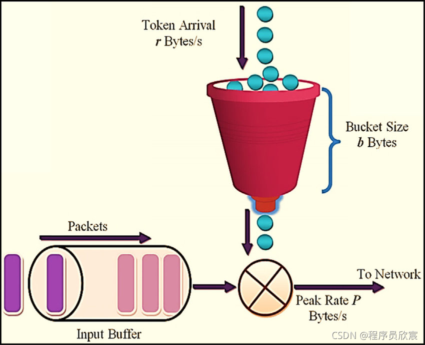
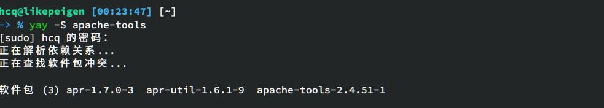
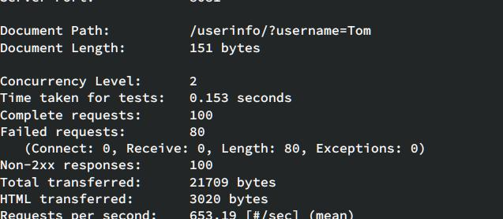

---
title: spring-cloud-gateway-限流过滤器 
date: 2021-12-15 22:28:49
tags: spring-cloud-gateway
---  
# 限流过滤器
- 在6中我们看到了很多过滤器，但没有这篇讲的这个。
- RequestRateLimiter 限流，RequestRateLimiterGatewayFilterFactory生成。

## 1. 关于限流
- 默认的限流器是基于redis实现的，限流算法令牌桶（Token Bucket Algorithm）,关于令牌捅的原理就不在此展开了，
- 装令牌的桶容量有限，例如最多20个，令牌进入桶的速度恒定（注意，这里是和漏桶算法的区别），例如每秒10个，底部每个请求能拿到令牌才会被处理：

    

## 2. 使用RequestRateLimiter过滤器的步骤
1. 准备可用的redis 
2. maven或者gradle中添加依赖org.springframework.boot:spring-boot-starter-data-redis-reactive
3. 确定按照什么维度限流，例如按照请求中的username参数限流，这是通过编写KeyResolver接口的实现来完成的
4. 配置application.yml文件，添加过滤器

## 3. 实现
1. 添加一个接口
```java
@RestController
public class UserInfoController {
    private String dateStr(){
        return new SimpleDateFormat("yyyy-MM-dd hh:mm:ss").format(new Date());
    }

    @GetMapping("/userinfo")
    public String userInfo(@RequestParam("username") String username) {
        return Constants.HELLO_PREFIX + " " + username + ", " + dateStr();
    }
}
```
2. xml新增
```xml
<dependency>
            <groupId>org.springframework.boot</groupId>
            <artifactId>spring-boot-starter-data-redis-reactive</artifactId>
</dependency>
```
3. application.yml
```yml
server:
  #服务端口
  port: 8081
spring:
  application:
    name: circuitbreaker-gateway
  # redis配置
  redis:
    host: 127.0.0.1
    port: 6379

  cloud:
    gateway:
      routes:
        - id: path_route
          uri: http://127.0.0.1:8082
          predicates:
            - Path=/hello/**
          filters:
            - name: RequestRateLimiter
              args:
              	# 令牌入桶的速度为每秒100个，相当于QPS
                redis-rate-limiter.replenishRate: 100
                # 桶内能装200个令牌，相当于峰值，要注意的是：第一秒从桶内能去200个，但是第二秒只能取到100个了，因为入桶速度是每秒100个
                redis-rate-limiter.burstCapacity: 200
                # 每个请求需要的令牌数
                redis-rate-limiter.requestedTokens: 1
```
4. 指定限流维度的代码CustomizeConfig.java，
- 这里是根据请求参数username的值来限流的，假设真实请求中一半请求的username的等于Tom，另一半的username的等于Jerry，按照application.yml的配置，Tom的请求QPS为100，Jerry的QPS也是100

```java
package com.bolingcavalry.gateway.config;

import org.springframework.cloud.gateway.filter.ratelimit.KeyResolver;
import org.springframework.context.annotation.Bean;
import org.springframework.context.annotation.Configuration;
import reactor.core.publisher.Mono;
import java.util.Objects;

@Configuration
public class CustomizeConfig {
    @Bean
    KeyResolver userKeyResolver() {
        return exchange -> Mono.just(exchange.getRequest().getQueryParams().getFirst("username"));
    }
}

```

## 4. 验证
1. 确保redis已经启动，并且与application.yml中的配置保持一直
2. 启动nacos（provider-hello依赖）
3. 启动服务提供者provider-hello
4. 启动gateway
5. 为了模拟web请求，这里使用了Apache Benchmark
- 安装的话 linux下发行版里一般有

    

执行如下命令
```shell
ab -n 10000  -c 2 http://localhost:8081/userinfo/userinfo?username=Tom

```

  

可以看到，100个请求只成功了20个。  