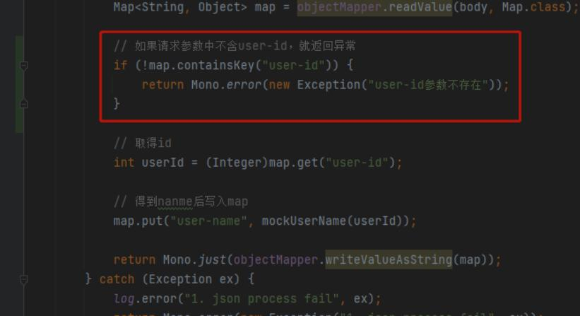

---
title: sc-gateway-10-修改请求响应体
date: 2021-12-18 22:28:40
tags: spring-cloud-gateway
---  
# 10.sc-gateway-10-修改请求响应体

## 1 修改请求响应体的几种做法
1. 可以自己写一个全局过滤器，获取请求体，修改请求体。但对scg所使用的非servlet技术会比较陌生。
2. ReadBodyPredicateFactory里面缓存了request body的信息，于是在自定义router中配置了ReadBodyPredicateFactory，然后在filter中通过cachedRequestBodyObject缓存字段获取request body信息。
3. 官方推荐的做法是 ModifyRequestBody ，ModifyResponseBody  

 - 官方推荐的3是1的简化版本，在06中我们也知道了  
 25. ModifyResponseBody  
 24. ModifyRequestBody  
可以修改响应体和请求体，那具体该怎么做呢？  

## 2 修改请求体步骤

1. 在代码配置路由的时候，调用filters方法，该方法的入参是个lambda表达式
2. 此lambda表达式固定调用modifyResponseBody方法，咱们只要定义好modifyResponseBody方法的三个入参即可
3. modifyRequestBody方法的第一个入参是输入类型,第二个入参是返回类型
4. 第三个是RewriteFunction接口的实现

我们要写的就是RewriteFunction接口的实现
1. 接口实现
```java
package com.bolingcavalry.changebody.function;

import com.fasterxml.jackson.databind.ObjectMapper;
import lombok.extern.slf4j.Slf4j;
import org.reactivestreams.Publisher;
import org.springframework.cloud.gateway.filter.factory.rewrite.RewriteFunction;
import org.springframework.web.server.ServerWebExchange;
import reactor.core.publisher.Mono;
import java.util.Map;


@Slf4j
public class RequestBodyRewrite implements RewriteFunction<String, String> {

    private ObjectMapper objectMapper;

    public RequestBodyRewrite(ObjectMapper objectMapper) {
        this.objectMapper = objectMapper;
    }

    /**
     * 根据用户ID获取用户名称的方法，可以按实际情况来内部实现，例如查库或缓存，或者远程调用
     * @param userId
     * @return
     */
    private  String mockUserName(int userId) {
        return "user-" + userId;
    }

    @Override
    public Publisher<String> apply(ServerWebExchange exchange, String body) {
        try {
            Map<String, Object> map = objectMapper.readValue(body, Map.class);

            // 取得id
            int userId = (Integer)map.get("user-id");

            // 得到nanme后写入map
            map.put("user-name", mockUserName(userId));

            // 添加一个key/value
            map.put("gateway-request-tag", userId + "-" + System.currentTimeMillis());

            return Mono.just(objectMapper.writeValueAsString(map));
        } catch (Exception ex) {
            log.error("1. json process fail", ex);
            // json操作出现异常时的处理
            return Mono.error(new Exception("1. json process fail", ex));
        }
    }
}
```

2. 配置类
```java
package com.bolingcavalry.changebody.config;

import com.bolingcavalry.changebody.function.RequestBodyRewrite;
import com.bolingcavalry.changebody.function.ResponseBodyRewrite;
import com.fasterxml.jackson.databind.ObjectMapper;
import org.springframework.cloud.gateway.route.RouteLocator;
import org.springframework.cloud.gateway.route.builder.RouteLocatorBuilder;
import org.springframework.context.annotation.Bean;
import org.springframework.context.annotation.Configuration;
import org.springframework.http.MediaType;
import reactor.core.publisher.Mono;

@Configuration
public class FilterConfig {
    @Bean
    public RouteLocator routes(RouteLocatorBuilder builder, ObjectMapper objectMapper) {
        return builder
                .routes()
                .route("path_route_change",
                        r -> r.path("/change")
                                .filters(f -> f
                                        .modifyRequestBody(String.class,String.class,new RequestBodyRewrite(objectMapper))
                                        )
                        .uri("http://127.0.0.1:8082"))
                .build();
    }
}

```

## 3.修改响应体也是同样的套路
接口
```java
package com.bolingcavalry.changebody.function;

import com.fasterxml.jackson.databind.ObjectMapper;
import lombok.extern.slf4j.Slf4j;
import org.reactivestreams.Publisher;
import org.springframework.cloud.gateway.filter.factory.rewrite.RewriteFunction;
import org.springframework.web.server.ServerWebExchange;
import reactor.core.publisher.Mono;
import java.util.Map;

@Slf4j
public class ResponseBodyRewrite implements RewriteFunction<String, String> {

    private ObjectMapper objectMapper;

    public ResponseBodyRewrite(ObjectMapper objectMapper) {
        this.objectMapper = objectMapper;
    }

    @Override
    public Publisher<String> apply(ServerWebExchange exchange, String body) {
        try {
            Map<String, Object> map = objectMapper.readValue(body, Map.class);

            // 取得id
            int userId = (Integer)map.get("user-id");

            // 添加一个key/value
            map.put("gateway-response-tag", userId + "-" + System.currentTimeMillis());

            return Mono.just(objectMapper.writeValueAsString(map));
        } catch (Exception ex) {
            log.error("2. json process fail", ex);
            return Mono.error(new Exception("2. json process fail", ex));
        }
    }
}
```
2. 配置类
```java
package com.bolingcavalry.changebody.config;

import com.bolingcavalry.changebody.function.RequestBodyRewrite;
import com.bolingcavalry.changebody.function.ResponseBodyRewrite;
import com.fasterxml.jackson.databind.ObjectMapper;
import org.springframework.cloud.gateway.route.RouteLocator;
import org.springframework.cloud.gateway.route.builder.RouteLocatorBuilder;
import org.springframework.context.annotation.Bean;
import org.springframework.context.annotation.Configuration;
import org.springframework.http.MediaType;
import reactor.core.publisher.Mono;

@Configuration
public class FilterConfig {

    @Bean
    public RouteLocator routes(RouteLocatorBuilder builder, ObjectMapper objectMapper) {
        return builder
                .routes()
                .route("path_route_change",
                        r -> r.path("/change")
                                .filters(f -> f
                                        .modifyRequestBody(String.class,String.class,new RequestBodyRewrite(objectMapper))
                                        .modifyResponseBody(String.class, String.class, new ResponseBodyRewrite(objectMapper))
                                        )
                        .uri("http://127.0.0.1:8082"))
                .build();
    }
}
```

## 4. 异常处理初探
1. 修改请求或者响应body的过程中，如果发现问题需要提前返回错误（例如必要的字段不存在），代码该怎么写？
2. 我们修改请求body的代码集中在RequestBodyRewrite.java，增加下图内容


3. 想告诉客户端具体的错误，但实际上客户端收到的是被Gateway框架处理后的内容  

对于异常的探究接下来一篇文章会接着写