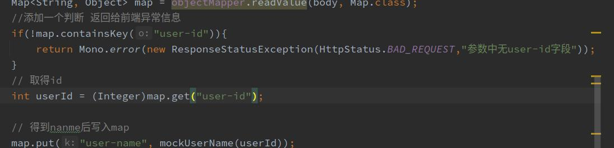
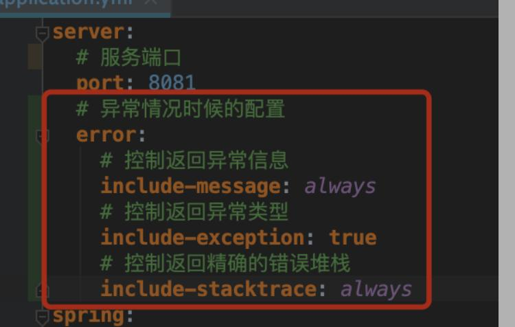
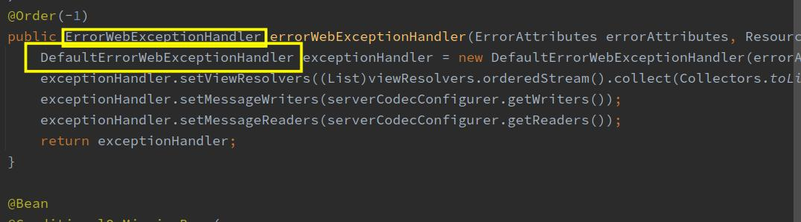
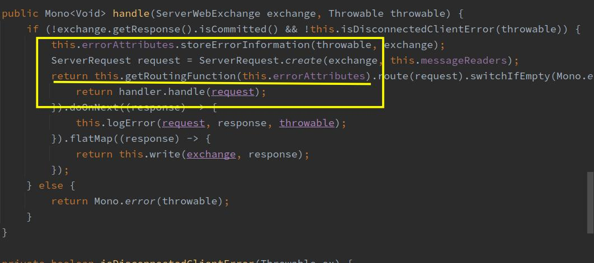
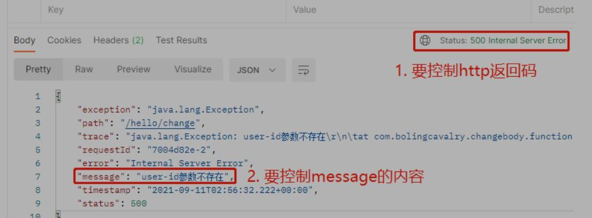

---
title: sc-gateway-11-异常处理
date: 2021-12-18 22:30:40
tags: spring-cloud-gateway
---  

# sc-gateway-11-异常处理
 先上异常处理的步骤

## 1. 处理异常的步骤
1. 抛出ResponseStatusException异常
> 第一种就是抛出 ResponseStatusException异常，如下图所示。



还需要在yml配置如下图


这是因为DefaultErrorWebExceptionHandler.isIncludeMessage方法是这样的
```java
 protected boolean isIncludeMessage(ServerRequest request, MediaType produces) {
        switch(this.errorProperties.getIncludeMessage()) {
        case ALWAYS:
            return true;
        case ON_PARAM:
            return this.isMessageEnabled(request);
        default:
            return false;
        }
    }
```
会读取配置，然后按照配置文件的需求返回信息。  


2. 自定义异常，带ResponseStatus注解

```java
import org.springframework.http.HttpStatus;
import org.springframework.web.bind.annotation.ResponseStatus;

@ResponseStatus(code= HttpStatus.BAD_REQUEST,reason = "user-id不能为空")
public class TestGatewayException extends Exception{
    
}
```
返回的时候返回这个异常类


## 2. 源码分析

spring-cloud-gateway 是基于spring-reactive技术的，没有使用servlet。spring-cloud-gateway 异常的处理也是由reactive的api完成的。

- 配置类
> org.springframework.boot.autoconfigure.web.reactive.error 包下有一个类
> ErrorWebFluxAutoConfiguration，这个配置类注入了两个重要的类。

1. DefaultErrorWebExceptionHandler：这个类是ErrorWebExceptionHandler的实现类

2. 处理异常时，会通过FluxOnErrorResume调用到这个ErrorWebExceptionHandler的handle方法处理，该方法在其父类AbstractErrorWebExceptionHandler.java中，如下图，红框位置的代码是关键，异常返回内容就是在这里决定的：

会发现此方法调用 DefaultErrorWebExceptionHandler 中的方法 getRoutingFunction
    ```java
    protected RouterFunction<ServerResponse> getRoutingFunction(ErrorAttributes errorAttributes) {
        return RouterFunctions.route(this.acceptsTextHtml(), this::renderErrorView).andRoute(RequestPredicates.all(), this::renderErrorResponse);
    }
    ```  

    this::renderErrorResponse如下所示
    ```java
        protected Mono<ServerResponse> renderErrorResponse(ServerRequest request) {
        //构造返回的map对象
        Map<String, Object> error = this.getErrorAttributes(request, this.getErrorAttributeOptions(request, MediaType.ALL));
        //返回信息
        return ServerResponse.status(this.getHttpStatus(error)).contentType(MediaType.APPLICATION_JSON).body(BodyInserters.fromValue(error));
    }

    ```

3. 经过上述过程，可以知道。
    > 返回给调用方的状态码，取决于getHttpStatus方法的返回值
    > 返回给调用方的body，取决于error的内容

    ```java
     protected int getHttpStatus(Map<String, Object> errorAttributes) {
    return (int) errorAttributes.get("status");
    }
    ```
    可以发现 getErrorAttributes方法的返回值是决定返回码和返回body的关键！

    ```java
        public Map<String, Object> getErrorAttributes(ServerRequest request, ErrorAttributeOptions options) {
        Map<String, Object> errorAttributes = this.getErrorAttributes(request, options.isIncluded(Include.STACK_TRACE));
        if (!options.isIncluded(Include.EXCEPTION)) {
            errorAttributes.remove("exception");
        }

        if (!options.isIncluded(Include.STACK_TRACE)) {
            errorAttributes.remove("trace");
        }

        if (!options.isIncluded(Include.MESSAGE) && errorAttributes.get("message") != null) {
            errorAttributes.remove("message");
        }

        if (!options.isIncluded(Include.BINDING_ERRORS)) {
            errorAttributes.remove("errors");
        }

        return errorAttributes;
    }

    private Map<String, Object> getErrorAttributes(ServerRequest request, boolean includeStackTrace) {
        Map<String, Object> errorAttributes = new LinkedHashMap();
        errorAttributes.put("timestamp", new Date());
        errorAttributes.put("path", request.path());
        Throwable error = this.getError(request);
        MergedAnnotation<ResponseStatus> responseStatusAnnotation = MergedAnnotations.from(error.getClass(), SearchStrategy.TYPE_HIERARCHY).get(ResponseStatus.class);
        HttpStatus errorStatus = this.determineHttpStatus(error, responseStatusAnnotation); //1 
        errorAttributes.put("status", errorStatus.value());
        errorAttributes.put("error", errorStatus.getReasonPhrase());
        errorAttributes.put("message", this.determineMessage(error, responseStatusAnnotation));
        errorAttributes.put("requestId", request.exchange().getRequest().getId());
        this.handleException(errorAttributes, this.determineException(error), includeStackTrace);
        return errorAttributes;
    }

     private HttpStatus determineHttpStatus(Throwable error, MergedAnnotation<ResponseStatus> responseStatusAnnotation) {
         // 异常对象是不是ResponseStatusException类型
          // 如果是ResponseStatusException类型，就调用异常对象的getStatus方法作为返回值
          //  如果异常对象既不是ResponseStatusException类型，也没有ResponseStatus注解，就返回500
        return error instanceof ResponseStatusException ? (
        (ResponseStatusException)error).getStatus() : (HttpStatus)responseStatusAnnotation.getValue("code", HttpStatus.class).orElse(HttpStatus.INTERNAL_SERVER_ERROR);
    }

    private String determineMessage(Throwable error, MergedAnnotation<ResponseStatus> responseStatusAnnotation) {
        if (error instanceof BindingResult) {
             // 异常对象是不是BindingResult类型
              // 如果是，就用getMessage作为返回值
            return error.getMessage();
        } else if (error instanceof ResponseStatusException) {
            // 如果不是BindingResult类型，就看是不是ResponseStatusException类型
            //// 如果是，就用getReason作为返回值
            return ((ResponseStatusException)error).getReason();
        } else {
            // 如果也不是ResponseStatusException类型，
            // 就看异常类有没有ResponseStatus注解，如果有就取该注解的reason属性作为返回值
            String reason = (String)responseStatusAnnotation.getValue("reason", String.class).orElse("");
            if (StringUtils.hasText(reason)) {
                return reason;
            } else {
                 // 如果通过注解取得的reason也无效，就返回异常的getMessage字段
                return error.getMessage() != null ? error.getMessage() : "";
            }
        }
    }
    ```
- 查看上面的源码，返回码来自determineHttpStatus的返回，
message字段来自determineMessage的返回。
- 返回的逻辑就是我们在第一节中的处理逻辑
- 1 抛出一个ResponseStatusException异常
- 2 自定义异常，带ResponseStatus注解

## 3. 定制异常体的内容
在第一节我们已经可以返回想要的状态码和异常信息，但是请看下图。

- 异常发生时系统固定返回8个字段，这就有些不够灵活了，在一些对格式和内容有严格要求的场景下，咱们需要能够完全控制返回码和返回body的内容，如下所示，只返回三个字段，每个字段都是完全为业务服务的
- 我们要通过编码定制异常发生时的返回信息，具体内容就只有code、message、data三个字段
  
具体该怎么做呢？
Spring Cloud Gateway是基于WebFlux的，咱们之前处理异常时用到的HttpServletRequest在Spring Cloud Gateway中并不适用，因此，不能用ControllerAdvice和ExceptionHandler的手段来处理全局异常

>1 做个新的类继承DefaultErrorWebExceptionHandler，覆盖其renderErrorResponse方法，新的renderErrorResponse方法中，按照实际业务需要来设置返回内容，没错，这就是咱们的思路，不过还要细化一下，最终具体的步骤如下：

>1. 新增一个异常类CustomizeInfoException.java，该类有三个字段：http返回码、业务返回码、业务描述信息
>2. 在返回异常的代码位置，使用CustomizeInfoException类来抛出异常，按照实际业务场景设置CustomizeInfoException实例的各个字段
>3. 新增MyErrorWebExceptionHandler.java，继承自DefaultErrorWebExceptionHandler，重写了renderErrorResponse方法，这里面检查异常实例是否是CustomizeInfoException类型，如果是，就从其中取出http返回码、业务返回码、业务描述信息等字段，构造返回body的内容，异常实例若不是CustomizeInfoException类型，就保持之前的处理逻辑不变；
>4. 新增configuration类，用于将MyErrorWebExceptionHandler实例注册到spring环境

1. 新增异常类CustomizeInfoException.java

```java
@Data
public class CustomizeInfoException extends Exception {
    /**
     * http返回码
     */
    private HttpStatus httpStatus;

    /**
     * body中的code字段(业务返回码)
     */
    private String code;

    /**
     * body中的message字段(业务返回信息)
     */
    private String message;
}
```
2. 修改RequestBodyRewrite.java的apply方法，这里面是在处理请求body，如果检查到没有user-id字段，就不将请求转发到服务提供方provider-hello，而是返回错误，这里的错误就用CustomizeInfoException类来处理：

```java
 // 如果请求参数中不含user-id，就返回异常
            if (!map.containsKey("user-id")) {
                CustomizeInfoException customizeInfoException = new CustomizeInfoException();
                // 这里返回406，您可以按照业务需要自行调整
                customizeInfoException.setHttpStatus(HttpStatus.NOT_ACCEPTABLE);

                // 这里按照业务需要自行设置code
                customizeInfoException.setCode("010020003");

                // 这里按照业务需要自行设置返回的message
                customizeInfoException.setMessage("请确保请求参数中的user-id字段是有效的");

                return Mono.error(customizeInfoException);
            }

```
3. 异常处理类DemoErrorWebExceptionHandler.java

```java
import org.springframework.boot.autoconfigure.web.ErrorProperties;
import org.springframework.boot.autoconfigure.web.ResourceProperties;
import org.springframework.boot.autoconfigure.web.reactive.error.DefaultErrorWebExceptionHandler;
import org.springframework.boot.web.reactive.error.ErrorAttributes;
import org.springframework.context.ApplicationContext;
import org.springframework.http.MediaType;
import org.springframework.web.reactive.function.BodyInserters;
import org.springframework.web.reactive.function.server.ServerRequest;
import org.springframework.web.reactive.function.server.ServerResponse;
import reactor.core.publisher.Mono;

import java.util.HashMap;
import java.util.Map;

public class CustomizeErrorWebExceptionHandler extends DefaultErrorWebExceptionHandler {
    public CustomizeErrorWebExceptionHandler(ErrorAttributes errorAttributes, ResourceProperties resourceProperties, ErrorProperties errorProperties, ApplicationContext applicationContext) {
        super(errorAttributes, resourceProperties, errorProperties, applicationContext);
    }

    @Override
    protected Mono<ServerResponse> renderErrorResponse(ServerRequest request) {
        // 返回码
        int status;
        // 最终是用responseBodyMap来生成响应body的
        Map<String, Object> responseBodyMap = new HashMap<>();

        // 这里和父类的做法一样，取得DefaultErrorAttributes整理出来的所有异常信息
        Map<String, Object> error = getErrorAttributes(request, getErrorAttributeOptions(request, MediaType.ALL));

        // 原始的异常信息可以用getError方法取得
        Throwable throwable = getError(request);

        // 如果异常类是咱们定制的，就定制
        if (throwable instanceof CustomizeInfoException) {
            CustomizeInfoException myGatewayException = (CustomizeInfoException) throwable;
            // http返回码、body的code字段、body的message字段，这三个信息都从CustomizeInfoException实例中获取
            status = myGatewayException.getHttpStatus().value();
            responseBodyMap.put("code", myGatewayException.getCode());
            responseBodyMap.put("message", myGatewayException.getMessage());
            responseBodyMap.put("data", null);
        } else {
            // 如果不是咱们定制的异常，就维持和父类一样的逻辑
            // 返回码
            status = getHttpStatus(error);
            // body内容
            responseBodyMap.putAll(error);
        }

        return ServerResponse
                // http返回码
                .status(status)
                // 类型和以前一样
                .contentType(MediaType.APPLICATION_JSON)
                // 响应body的内容
                .body(BodyInserters.fromValue(responseBodyMap));
    }
}
```

4. 配置类DemoErrorWebFluxAutoConfiguration

```java
import com.rrs.scgateway.exception.CustomizeErrorWebExceptionHandler;
import org.springframework.beans.factory.ObjectProvider;
import org.springframework.boot.autoconfigure.AutoConfigureBefore;
import org.springframework.boot.autoconfigure.web.ResourceProperties;
import org.springframework.boot.autoconfigure.web.ServerProperties;
import org.springframework.boot.autoconfigure.web.reactive.WebFluxAutoConfiguration;
import org.springframework.boot.web.reactive.error.ErrorAttributes;
import org.springframework.boot.web.reactive.error.ErrorWebExceptionHandler;
import org.springframework.context.ApplicationContext;
import org.springframework.context.annotation.Bean;
import org.springframework.context.annotation.Configuration;
import org.springframework.core.annotation.Order;
import org.springframework.http.codec.ServerCodecConfigurer;
import org.springframework.web.reactive.result.view.ViewResolver;

import java.util.List;
import java.util.stream.Collectors;

@Configuration(proxyBeanMethods = false)
@AutoConfigureBefore(WebFluxAutoConfiguration.class)
public class CustomizeErrorWebFluxAutoConfiguration {

    private final ServerProperties serverProperties;

    public CustomizeErrorWebFluxAutoConfiguration(ServerProperties serverProperties) {
        this.serverProperties = serverProperties;
    }

    //这里复制ErrorWebFluxAutoConfiguration 注入DefaultErrorWebExceptionHandler 
    //的方法。然后改成返回CustomizeErrorWebExceptionHandler即可
    //因为springboot版本的不同，代码会有改变，要跟着版本走。
    @Bean
    @Order(-1)
    public ErrorWebExceptionHandler errorWebExceptionHandler(ErrorAttributes errorAttributes, ResourceProperties resourceProperties, ObjectProvider<ViewResolver> viewResolvers, ServerCodecConfigurer serverCodecConfigurer, ApplicationContext applicationContext) {
        CustomizeErrorWebExceptionHandler exceptionHandler = new CustomizeErrorWebExceptionHandler(errorAttributes, resourceProperties, this.serverProperties.getError(), applicationContext);
        exceptionHandler.setViewResolvers((List)viewResolvers.orderedStream().collect(Collectors.toList()));
        exceptionHandler.setMessageWriters(serverCodecConfigurer.getWriters());
        exceptionHandler.setMessageReaders(serverCodecConfigurer.getReaders());
        return exceptionHandler;
    }

}
```
- 为什么自定义的CustomizeErrorWebExceptionHandler类会生效呢？  
- 因为原来的配置类中ConditionalOnMissingBean注解存在，所以我们自定义的注解生效后，这个DefaultErrorWebExceptionHandler 会被自定义的替换掉。
一些逻辑也会走父类的逻辑，因为我们只重写了一个方法。
```java
    @Bean
    @ConditionalOnMissingBean(
        value = {ErrorWebExceptionHandler.class},
        search = SearchStrategy.CURRENT
    )
    @Order(-1)
    public ErrorWebExceptionHandler errorWebExceptionHandler(ErrorAttributes errorAttributes, ResourceProperties resourceProperties, ObjectProvider<ViewResolver> viewResolvers, ServerCodecConfigurer serverCodecConfigurer, ApplicationContext applicationContext) {
        DefaultErrorWebExceptionHandler exceptionHandler = new DefaultErrorWebExceptionHandler(errorAttributes, resourceProperties, this.serverProperties.getError(), applicationContext);
        exceptionHandler.setViewResolvers((List)viewResolvers.orderedStream().collect(Collectors.toList()));
        exceptionHandler.setMessageWriters(serverCodecConfigurer.getWriters());
        exceptionHandler.setMessageReaders(serverCodecConfigurer.getReaders());
        return exceptionHandler;
    }
```
