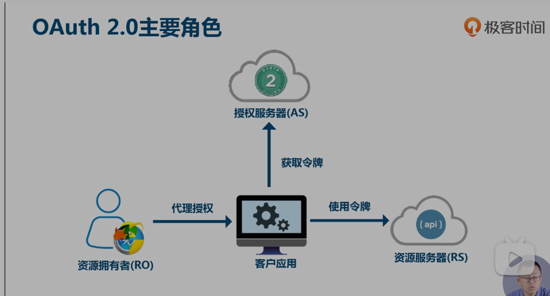

## spring-oauth2-01 oauth2 认识

### 1. oauth2 是什么
>先上结论，oauth2是一种给予权限(认证、发令牌)的规范，现在是由几个大互联网大厂共同维护。针对此规范，不同的厂商有不同的实现。不同的产品细节不同，内部如何实现也不同，但他们都遵循基本的oauth2规范。  

oauth2规范有三个角色。

- 用户 资源拥有者
- 客户端 想要拿用户资源
- 服务器 
  - 认证服务器 给客户端发token的
  - 资源服务器 客户端拿token取资源的地方

其中资源服务器和认证服务器可以是同一台服务器，但最好分开。  

- 这其中，客户端如何取到token，规范规定了几种方式，是重点。
- 资源服务器如何认证也是一个小重点。
- 学习oauth2,把握住一个要点 取token和验证token

下面这两张图可以解释各方的作用

oauth最早于2007年提出，经过多年发展形成了oauth2规范。
oauth规范的历程如下。  

大牛写的更好，参考下面的链接。  
[OAuth 2.0 的一个简单解释](https://www.ruanyifeng.com/blog/2019/04/oauth_design.html)
[微服务中的oauth2](https://www.bilibili.com/video/BV1g3411i7YL?p=4) 

### 2. oauth2的获取token的模式

官方规范了四种方式来获取token  
分别是

授权码（authorization-code）
隐藏式（implicit）
密码式（password）：
客户端凭证（client credentials）  

依然是阮一峰的博客
[oauth2认证方式](https://www.ruanyifeng.com/blog/2019/04/oauth-grant-types.html)

### 3. 如何选择 oauth2 获取token的方式 

记得下面这张图就可以了

