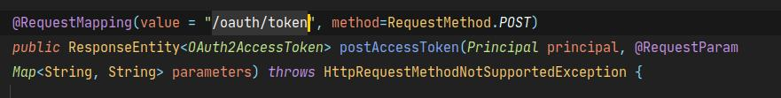

## spring-oauth2-03-获取token的流程

### 1.获取token的流程

#### 1.1 为什么要看流程

- 我们已经知道oauth2服务器的作用如左图所示


> 我们的目标就是将Spring Security OAuth默认的走授权流程后发放token的步骤替换成走我们自定义的认证方式后发放token，除此之外，其他的认证校验步骤（如访问资源服务器的认证、授权等）仍然可以使用Spring Security OAuth提供的默认实现来完成。

#### 1.2 获取源码的核心流程
- 经过探究源码，先上结论，获取的核心流程如下


- 每一种授权方式有些差异，例如默认的密码授权时序图如下。


针对获取token的流程，我们探究查看代码。

#### 1.3 源码简析

##### 1 获取用户信息和认证用户
- 获取token的端点如下，发送获取token请求的源码会被解析到这里。


```java
@RequestMapping(value = "/oauth/token", method=RequestMethod.POST)
	public ResponseEntity<OAuth2AccessToken> postAccessToken(Principal principal, @RequestParam
	Map<String, String> parameters) throws HttpRequestMethodNotSupportedException {

		if (!(principal instanceof Authentication)) {
			throw new InsufficientAuthenticationException(
					"There is no client authentication. Try adding an appropriate authentication filter.");
		}
        //获取客户端id
		String clientId = getClientId(principal);
        //从数据库获取客户端信息
		ClientDetails authenticatedClient = getClientDetailsService().loadClientByClientId(clientId);
        //构造TokenRequest对象  1 
		TokenRequest tokenRequest = getOAuth2RequestFactory().createTokenRequest(parameters, authenticatedClient);

		if (clientId != null && !clientId.equals("")) {
			// Only validate the client details if a client authenticated during this
			// request.
			if (!clientId.equals(tokenRequest.getClientId())) {
				// double check to make sure that the client ID in the token request is the same as that in the
				// authenticated client
				throw new InvalidClientException("Given client ID does not match authenticated client");
			}
		}
		if (authenticatedClient != null) {
			oAuth2RequestValidator.validateScope(tokenRequest, authenticatedClient);
		}
        //没有授权方式就抛异常
		if (!StringUtils.hasText(tokenRequest.getGrantType())) {
			throw new InvalidRequestException("Missing grant type");
		}
        //隐士模式不需要走到这里面
		if (tokenRequest.getGrantType().equals("implicit")) {
			throw new InvalidGrantException("Implicit grant type not supported from token endpoint");
		}
        //如果有scope参数，则置为空
		if (isAuthCodeRequest(parameters)) {
			// The scope was requested or determined during the authorization step
			if (!tokenRequest.getScope().isEmpty()) {
				logger.debug("Clearing scope of incoming token request");
				tokenRequest.setScope(Collections.<String> emptySet());
			}
		}
        //如果是刷新token 保持原有的scope
		if (isRefreshTokenRequest(parameters)) {
			// A refresh token has its own default scopes, so we should ignore any added by the factory here.
			tokenRequest.setScope(OAuth2Utils.parseParameterList(parameters.get(OAuth2Utils.SCOPE)));
		}
        //获取token对象的真正的地方 2 
		OAuth2AccessToken token = getTokenGranter().grant(tokenRequest.getGrantType(), tokenRequest);
		if (token == null) {
			throw new UnsupportedGrantTypeException("Unsupported grant type");
		}

		return getResponse(token);

	}
```

1.  TokenRequest  对象如下

```java
@SuppressWarnings("serial")
public class TokenRequest extends BaseRequest {

	private String grantType;
....
}

@SuppressWarnings("serial")
abstract class BaseRequest implements Serializable {

	
	private String clientId;

	private Set<String> scope = new HashSet<String>();

	private Map<String, String> requestParameters = Collections
			.unmodifiableMap(new HashMap<String, String>());
....
}
```
TokenRequest 请求中的参数做了封装，包括客户端id,授权方式，授权所用的其他参数等。

2. getTokenGranter()会获取授权方式对应的TokenGranter，

```java
public class CompositeTokenGranter implements TokenGranter {

	private final List<TokenGranter> tokenGranters;

	public CompositeTokenGranter(List<TokenGranter> tokenGranters) {
		this.tokenGranters = new ArrayList<TokenGranter>(tokenGranters);
	}
	
	public OAuth2AccessToken grant(String grantType, TokenRequest tokenRequest) {
		for (TokenGranter granter : tokenGranters) {
            //遍历授权器 调用授权器的方法获取token
			OAuth2AccessToken grant = granter.grant(grantType, tokenRequest); //1 
			if (grant!=null) {
				return grant;
			}
		}
		return null;
	}
    ....
}
```
 
- grant()方法调用的是抽象类里的方法

```java
public abstract class AbstractTokenGranter implements TokenGranter {
	
	protected final Log logger = LogFactory.getLog(getClass());

	private final AuthorizationServerTokenServices tokenServices;
	public OAuth2AccessToken grant(String grantType, TokenRequest tokenRequest) {

		if (!this.grantType.equals(grantType)) {
			return null;
		}
		
		String clientId = tokenRequest.getClientId();
		ClientDetails client = clientDetailsService.loadClientByClientId(clientId);
		validateGrantType(grantType, client);

		if (logger.isDebugEnabled()) {
			logger.debug("Getting access token for: " + clientId);
		}

		return getAccessToken(client, tokenRequest);

	}

	protected OAuth2AccessToken getAccessToken(ClientDetails client, TokenRequest tokenRequest) {
		return tokenServices.createAccessToken(getOAuth2Authentication(client, tokenRequest)); //1 
	}

	protected OAuth2Authentication getOAuth2Authentication(ClientDetails client, TokenRequest tokenRequest) {
		OAuth2Request storedOAuth2Request = requestFactory.createOAuth2Request(client, tokenRequest);
		return new OAuth2Authentication(storedOAuth2Request, null);
	}

    .....
}
```
- 我们以密码模式为例看授权器如何获取到token   

密码模式对应的为ResourceOwnerPasswordTokenGranter 

上面的 getOAuth2Authentication(client, tokenRequest) 方法调用的是 ResourceOwnerPasswordTokenGranter 实现类里面的方法。
```java
public class ResourceOwnerPasswordTokenGranter extends AbstractTokenGranter {

	private static final String GRANT_TYPE = "password";

	private final AuthenticationManager authenticationManager;

	public ResourceOwnerPasswordTokenGranter(AuthenticationManager authenticationManager,
			AuthorizationServerTokenServices tokenServices, ClientDetailsService clientDetailsService, OAuth2RequestFactory requestFactory) {
		this(authenticationManager, tokenServices, clientDetailsService, requestFactory, GRANT_TYPE);
	}

	protected ResourceOwnerPasswordTokenGranter(AuthenticationManager authenticationManager, AuthorizationServerTokenServices tokenServices,
			ClientDetailsService clientDetailsService, OAuth2RequestFactory requestFactory, String grantType) {
		super(tokenServices, clientDetailsService, requestFactory, grantType);
		this.authenticationManager = authenticationManager;
	}

	@Override
	protected OAuth2Authentication getOAuth2Authentication(ClientDetails client, TokenRequest tokenRequest) {

		Map<String, String> parameters = new LinkedHashMap<String, String>(tokenRequest.getRequestParameters());
		String username = parameters.get("username");
		String password = parameters.get("password");
		// Protect from downstream leaks of password
		parameters.remove("password");

		Authentication userAuth = new UsernamePasswordAuthenticationToken(username, password);
		((AbstractAuthenticationToken) userAuth).setDetails(parameters);
		try {
			userAuth = authenticationManager.authenticate(userAuth); // 1 
		}
		catch (AccountStatusException ase) {
			//covers expired, locked, disabled cases (mentioned in section 5.2, draft 31)
			throw new InvalidGrantException(ase.getMessage());
		}
		catch (BadCredentialsException e) {
			// If the username/password are wrong the spec says we should send 400/invalid grant
			throw new InvalidGrantException(e.getMessage());
		}
		if (userAuth == null || !userAuth.isAuthenticated()) {
			throw new InvalidGrantException("Could not authenticate user: " + username);
		}
		
		OAuth2Request storedOAuth2Request = getRequestFactory().createOAuth2Request(client, tokenRequest);		
		return new OAuth2Authentication(storedOAuth2Request, userAuth);//2
	}
}
```
比较重要的是注释1  

会通过authenticationManager的实现类ProviderManager来验证传入的信息。

ProviderManager维护AuthenticationProvide集合，遍历AuthenticationProvide集合，如果哪一个支持，则使用这个AuthenticationProvide实现类。


密码模式对应的AuthenticationProvide实现类就是 DaoAuthenticationProvider

```java
public class DaoAuthenticationProvider extends AbstractUserDetailsAuthenticationProvider {

	private PasswordEncoder passwordEncoder;

protected final UserDetails retrieveUser(String username,
			UsernamePasswordAuthenticationToken authentication)
			throws AuthenticationException {
		prepareTimingAttackProtection();
		try {
			UserDetails loadedUser = this.getUserDetailsService().loadUserByUsername(username);
			if (loadedUser == null) {
				throw new InternalAuthenticationServiceException(
						"UserDetailsService returned null, which is an interface contract violation");
			}
			return loadedUser;
		}
		catch (UsernameNotFoundException ex) {
			mitigateAgainstTimingAttack(authentication);
			throw ex;
		}
		catch (InternalAuthenticationServiceException ex) {
			throw ex;
		}
		catch (Exception ex) {
			throw new InternalAuthenticationServiceException(ex.getMessage(), ex);
		}
	}

    ......
}

public abstract class AbstractUserDetailsAuthenticationProvider implements
		AuthenticationProvider, InitializingBean, MessageSourceAware {
public Authentication authenticate(Authentication authentication)  //2 
			throws AuthenticationException {
		Assert.isInstanceOf(UsernamePasswordAuthenticationToken.class, authentication,
				() -> messages.getMessage(
						"AbstractUserDetailsAuthenticationProvider.onlySupports",
						"Only UsernamePasswordAuthenticationToken is supported"));

		// Determine username
		String username = (authentication.getPrincipal() == null) ? "NONE_PROVIDED"
				: authentication.getName();

		boolean cacheWasUsed = true;
		UserDetails user = this.userCache.getUserFromCache(username);

		if (user == null) {
			cacheWasUsed = false;

			try {
				user = retrieveUser(username,
						(UsernamePasswordAuthenticationToken) authentication); //1 
			}


            .......

}
```  

在AbstractUserDetailsAuthenticationProvider的authenticate方法 返回的userAuth是一个Authentication对象（具体是那个实现类不同授权模式不同）。

最终在ResourceOwnerPasswordTokenGranter中返回一个OAuth2Authentication对象，这是tokenrequest对象和Authentication对象的封装。

----------------------------
>小结  

**源码读到现在，可以知晓它做的事情是。**
1. 我们拿到传递来的用户信息。
2. 根据信息里的授权模式找到了对应的授权类。
3. 对应的授权类又找到对应的认证类提供商进行了认证。
4. 使用传递过来的用户信息和认证得到的用户信息，得到OAuth2Authentication对象。

##### 2. 生成token
那么接下来就是拿着这个对象去生成token对象了


tokenServices官方暂时只有一个实现类DefaultTokenServices


DefaultTokenServices调用tokenstore获取token。   

官方实现的tokenStore
- RedisTokenStore
- InMemoryTokenStore
- JdbcTokenStore 
- JwtTokenStore

每一种tokenStore，实现的细节都不同。
要使用什么tokenStore自己可以使用第二篇将的配置授权服务器配置。

我们以RedisTokenStore为例探究


- 根据传入的OAuth2Authentication 生成一个key，猜测这个key应当和用户信息有关。
- 如果redis中没有这个key,那么accesstoken为null。返回null.
- 如果有，则说明已经登陆，则更新。//2

如果为null 返回上一层方法。

  

- 创建accesstoken
- 存储token
- 存储刷新token

--------------------------------
>小结

**生成token的过过程如下**

1. 获取TokenServices
2. TokenServices调用配置的 TokenStore 获取token

### 2. 修改

我们要修改框架，让他可以做微服务的授权中心。 
#### 1.生成token的简化流程  
>整体的生成token的过程可以梳理一下
> 1. 获取处理传入的信息
> 2. 获取授权类 (根据传入的授权模式)
> 3. 进行用户认证(根据授权类掉用时传入的对象，委托模式)
> 4. 认证通过一个对象
> 5. 获取TokenService 
> 6. 使用TokenStore 获取token(配置)

改造
1. 一是增加授权模式 
2. 增加认证模式 
3. 增加tokenStore ，例如增加mogodb等存储方式，生成方法等。
4. TokenService 方法增强

授权模式和认证模式是一对一的

#### 增加一种授权模式 

以增加手机号验证码为例子

1. 首先增加一个TokenGranter
   
```java
public class MobileSMSGranter extends AbstractTokenGranter {
    private static final String GRANT_TYPE = "mobile_sms";

    private final AuthenticationManager authenticationManager;

    public MobileSMSGranter(AuthenticationManager authenticationManager, AuthorizationServerTokenServices tokenServices
            , ClientDetailsService clientDetailsService, OAuth2RequestFactory requestFactory) {
        super(tokenServices, clientDetailsService, requestFactory, GRANT_TYPE);
        this.authenticationManager = authenticationManager;
    }

    @Override
    protected OAuth2Authentication getOAuth2Authentication(ClientDetails client, TokenRequest tokenRequest) {
        Map<String, String> parameters = new LinkedHashMap<>(tokenRequest.getRequestParameters());
        String mobile = parameters.get("mobile");
        String sms = parameters.get("sms");
        // Protect from downstream leaks of sms
        parameters.remove("sms");

        Authentication userAuth = new MobileSMSAuthenticationToken(mobile, sms); //1 
        ((AbstractAuthenticationToken) userAuth).setDetails(parameters); //2 
        userAuth = authenticationManager.authenticate(userAuth);
        if (userAuth == null || !userAuth.isAuthenticated()) {
            throw new InvalidGrantException("Could not authenticate mobile: " + mobile);
        }

        OAuth2Request storedOAuth2Request = getRequestFactory().createOAuth2Request(client, tokenRequest);
        return new OAuth2Authentication(storedOAuth2Request, userAuth);
    }
}

```
注意注释1处，要根据这个类判断调用哪种认证器。

2. 增加AbstractAuthenticationToken实现类

基本上和UsernamePasswordAuthenticationToken 这个官方实现类一样。

```java
public class MobileSMSAuthenticationToken extends AbstractAuthenticationToken {

	private static final long serialVersionUID = SpringSecurityCoreVersion.SERIAL_VERSION_UID;

	// ~ Instance fields
	// ================================================================================================

	private final Object principal;
	private Object credentials;

	// ~ Constructors
	// ===================================================================================================

	/**
	 * This constructor can be safely used by any code that wishes to create a
	 * <code>UsernamePasswordAuthenticationToken</code>, as the {@link #isAuthenticated()}
	 * will return <code>false</code>.
	 *
	 */
	public MobileSMSAuthenticationToken(String mobile, String password) {
		super(null);
		this.principal = mobile;
		this.credentials = password;
		setAuthenticated(false);
	}

	/**
	 * This constructor should only be used by <code>AuthenticationManager</code> or
	 * <code>AuthenticationProvider</code> implementations that are satisfied with
	 * producing a trusted (i.e. {@link #isAuthenticated()} = <code>true</code>)
	 * authentication token.
	 *
	 * @param principal
	 * @param authorities
	 */
	public MobileSMSAuthenticationToken(Object principal, Object credentials,
                                        Collection<? extends GrantedAuthority> authorities) {
		super(authorities);
		this.principal = principal;
		this.credentials = credentials;
		super.setAuthenticated(true);
	}

	// ~ Methods
	// ========================================================================================================

	@Override
	public Object getCredentials() {
		return this.credentials;
	}

	@Override
	public Object getPrincipal() {
		return this.principal;
	}

	@Override
	public void setAuthenticated(boolean isAuthenticated) {
		if (isAuthenticated) {
			throw new IllegalArgumentException(
					"Cannot set this token to trusted - use constructor which takes a GrantedAuthority list instead");
		}
		super.setAuthenticated(false);
	}

	@Override
	public void eraseCredentials() {
		super.eraseCredentials();
	}
}
```
3. 增加一个认证处理器

```java
public class MobileSMSAuthenticationProvider implements AuthenticationProvider {
    private UserDetailServiceFactory userDetailsServiceFactory;
    private PasswordEncoder passwordEncoder;

    //发送消息服务 用于验证验证码
    private MessageFeign  messageFeign;

    @Override
    public Authentication authenticate(Authentication authentication) {
        MobileSMSAuthenticationToken authenticationToken = (MobileSMSAuthenticationToken) authentication;
        String mobile = (String) authenticationToken.getPrincipal();
        String sms = (String) authenticationToken.getCredentials();
        //加载用户信息
        UserDetails user = userDetailsServiceFactory.getService(authenticationToken).loadUserByMobile(mobile);
        if (user == null) {
            throw new InternalAuthenticationServiceException("手机号错误");
        }
        //调用信息接口获取电话号码对应的验证码
        Result<Boolean> booleanResult = messageFeign.smsCodeValid(mobile, SmsCodeTemplateEnums.ADMIN_SEND.getTemplateCode(), sms, false);
        Boolean data = booleanResult.getData();
        if (!data) {
            throw new InternalAuthenticationServiceException("验证码错误");
        }

        MobileSMSAuthenticationToken authenticationResult = new MobileSMSAuthenticationToken(user, sms, user.getAuthorities());
        authenticationResult.setDetails(authenticationToken.getDetails());
        return authenticationResult;
    }

    @Override
    public boolean supports(Class<?> authentication) {
        return MobileSMSAuthenticationToken.class.isAssignableFrom(authentication);
    }
}
```

4. 将这个类配置进框架
```java
@Component
public class MobileSMSAuthenticationSecurityConfig extends SecurityConfigurerAdapter<DefaultSecurityFilterChain, HttpSecurity> {
    @Resource
    private UserDetailServiceFactory userDetailsServiceFactory;

    @Autowired
    private PasswordEncoder passwordEncoder;
    //发送消息服务 用于验证验证码
    @Autowired
    private MessageFeign messageFeign;

    @Override
    public void configure(HttpSecurity http) {
        //mobile provider
        MobileSMSAuthenticationProvider provider = new MobileSMSAuthenticationProvider();
        provider.setUserDetailsServiceFactory(userDetailsServiceFactory);
        provider.setPasswordEncoder(passwordEncoder);
        provider.setMessageFeign(messageFeign);
        http.authenticationProvider(provider);
    }
}
```

5. 要将这个TokenGranter 配置进框架  
   自定义bean list，然后配置进授权配置类。  

```java

    @Bean
    public TokenGranter tokenGranter() {}


配置类中配置
    /**
     * 配置身份认证器，配置认证方式，TokenStore，TokenGranter，OAuth2RequestFactory
     * @param endpoints
     */
    @Override
    public void configure(AuthorizationServerEndpointsConfigurer endpoints) {
        endpoints.tokenStore(tokenStore)
                .authenticationManager(authenticationManager)
                //.userDetailsService(userDetailsServiceFactory.getService(SecurityConstants.DEF_ACCOUNT_TYPE))
                .authorizationCodeServices(authorizationCodeServices)
                .exceptionTranslator(webResponseExceptionTranslator)
                .tokenGranter(tokenGranter);
    }


```

6. 认证方式增加到框架
在SecurityConfig 配置类中添加。
```java
@Override
	protected void configure(HttpSecurity http) throws Exception {
		http.authorizeRequests()
					.anyRequest()
					//授权服务器关闭basic认证
                    .permitAll()
                    .and()
				.logout()
					.logoutUrl(SecurityConstants.LOGOUT_URL)
					.logoutSuccessHandler(new OauthLogoutSuccessHandler())
					.addLogoutHandler(oauthLogoutHandler)
					.clearAuthentication(true)
					.and()
                .apply(openIdAuthenticationSecurityConfig)
                    .and()
				.apply(mobileAuthenticationSecurityConfig)
					.and()
				.apply(mobileSMSAuthenticationSecurityConfig)
					.and()
				.addFilterBefore(new LoginProcessSetTenantFilter(), UsernamePasswordAuthenticationFilter.class)
                .csrf().disable()
				// 解决不允许显示在iframe的问题
				.headers().frameOptions().disable().cacheControl();

```

#### 增强redis
#### 其他修改的方法
    todo