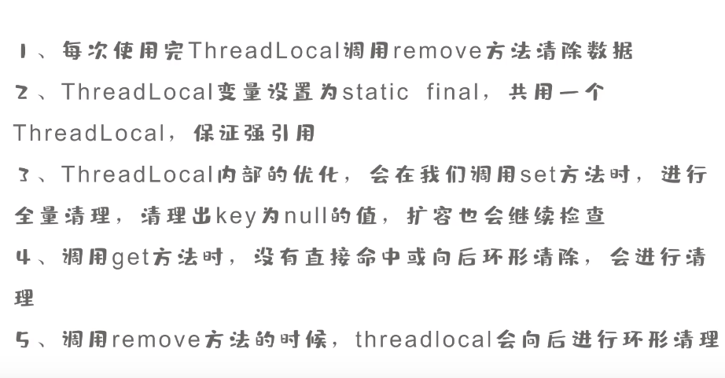
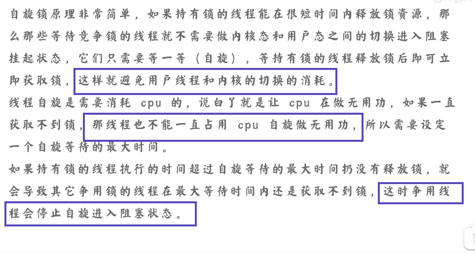
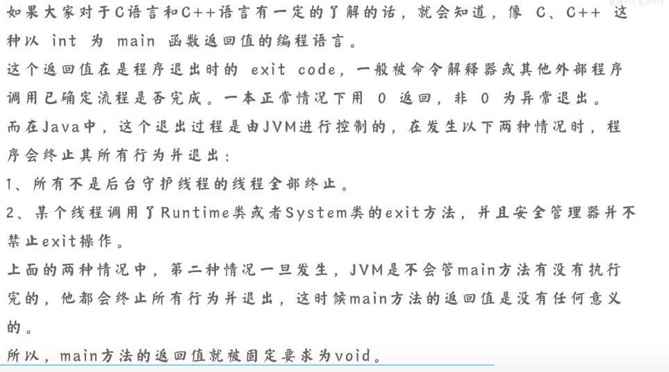
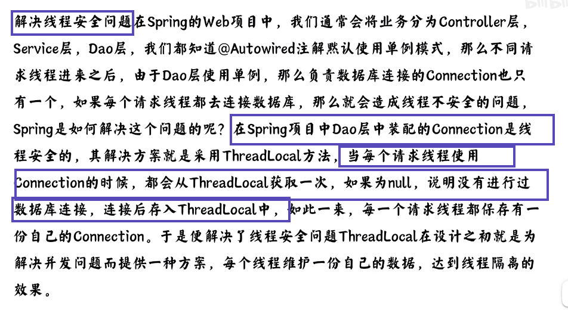
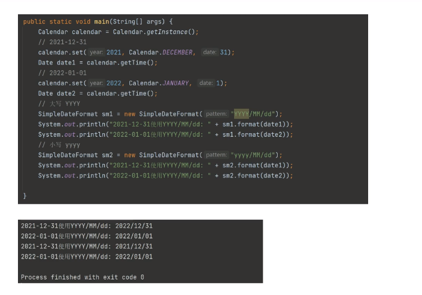
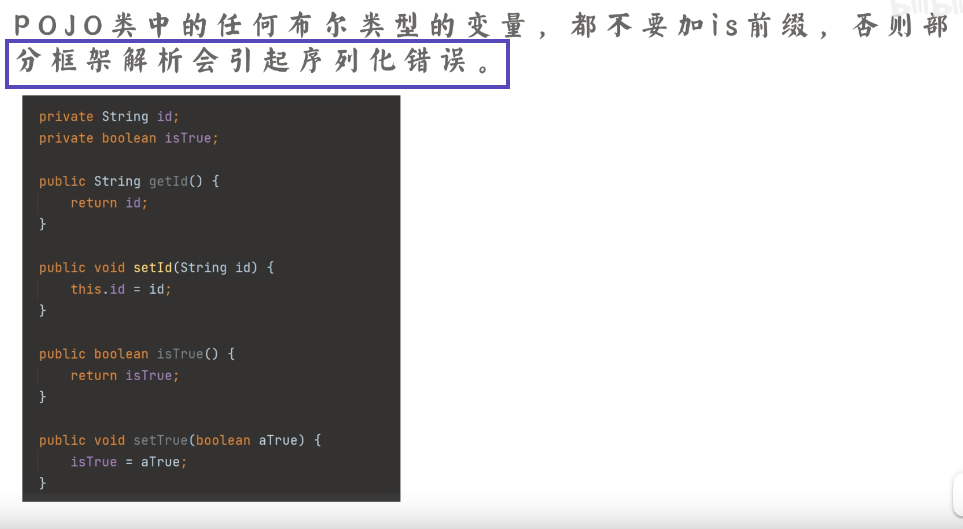

 

# java

## 1. 为什么线程池的submit不抛出异常？

提交方式为execute

提交方式为execute

会发现异常被吞了

因为内部确实把异常处理掉了

1. 

2. 

3.  

4.

对于runnable，因为没有返回值，也不需要返回值，所以自然应该使用execute方法，这时候如果报错了就直接抛出来了。而对于callable，如果你也不需要它的返回值，那你就不应该使用submit而且execute了。但如果你需要返回值，那一定是submit，而且你后面也一定会调用future.get，错误也应该在这个时候返回给调用者。我认为这是一个正确的设计，而且正确的调用方式也应该是这样: 

**无所谓runnable还是callable，只要你不需要返回值，就execute，需要就submit。**

## 2.Java线程池的工作过程

过程

## 3.线程池如何设置最优线程数

### 实际调优

## 4.Java线程启动为什么调用start方法而不是run方法？

说白了就是run方法是个模版方法

通俗讲就是别人提供了一个功能，但其中的一个步骤需要你来实现，相当于别人定义好了一个功能的流程，但其中一个步骤需要你来补充，就是模板方法 。所以你实现的这个方法是被他的功能调用的。比如list提供的排序功能 需要你实现或者传一个比较器给它。只有它的功能调你的方法才对它的功能有意义。假如你实现了一个比较器 但是你不传给list的排序方法调用 那么这个比较器只是一个普通方法 没有意义。同理 你实现了一个run方法 但是不把它提供给线程功能来调用 当然也没法完成线程功能

## 5.如何在一亿个数中找出最大的1万个数？

1. 

2. 

3.

## 6.如何从1000w记录中，找出最热门的10个记录？

## 7.Java中强应用、弱应用、软引用、虚引用的区别？

## 8.为什么ThreadLocal会产生内存泄漏？

### 泄露是如何产生的

其实我们常常所说的threadlocal的内存泄露指的是value的内存泄露，跟key的弱引用没关系，key的弱引用恰好是解决了key的内存泄露，但是解决不了value的内存泄露。所以，为了解决value的内存泄露，我们需要最后手动remove

### 如何解决

## 9.说说HashMap的扩容算法

### 什么是

## 10.如何实现亿级用户登录态的数据统计？

### 比较好的

## 11.什么是Java自旋锁？*

## 12.为什么Java中的main方法必须是public static void？

## 13.Java线程池的拒绝策略有哪些？

## 14.ThreadLocal的常用场景？

## 15.虚假唤醒问题！

## 16.Java中的final有啥用？

作用

## 17.为什么HashMap的负载因子是0.75？

## 18.Java如何优雅的中断线程？

### 1.中断

### 2.标志位

## 19.两个一样数字的integer比较，竟然不相等？

## 20.为什么大厂禁用Java内置线程池

### 什么是内置线程池

### 特点

### 建议使用

## 21.Java日期格式化为什么一定要用小写y？

### 实验

d	1~31 (月份的第几天, 带0)
D	1~366 (年份的第几天,带0)

## 22.为什么不要使用Arrays.asList()？

不能添加的匿名内部类
其实不到处乱传控制好使用范围的话倒也没什么不能使用的，一般也就是某个类因为业务临时要拦截某些特征码之类的东西会用一下，随便写个asList快速比对一下赶紧上线

## 23.为什么pojo的布尔类型不要用is开头？

说过布尔类型不能is开头，老的框架兼容不好，idea自动生成set/get方法会去掉开头的is

### 解决方案

## 24.金融业务常用的bigdecimal要注意什么？

### vlaueof（）

### 比较

### 精度

### tostring

