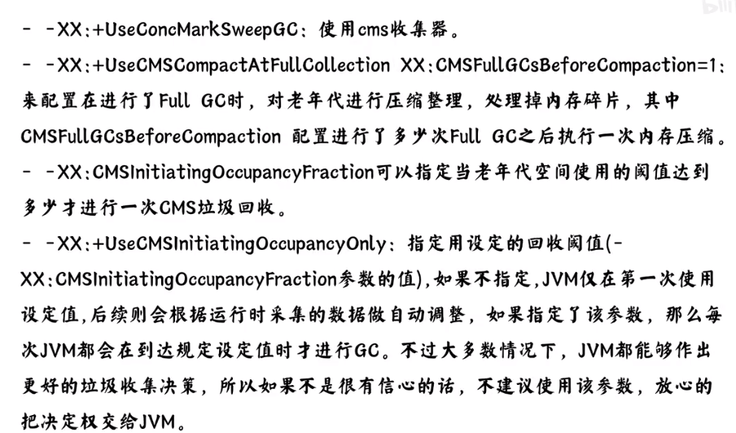
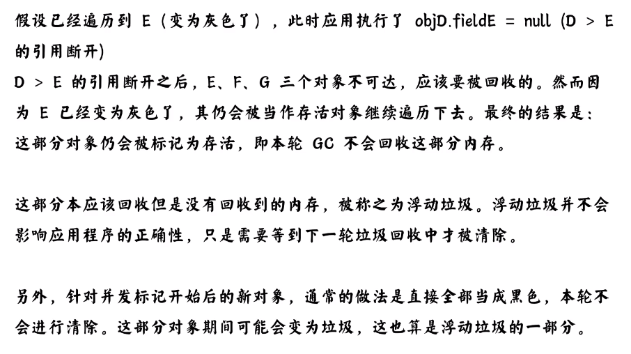

 

# jvm面试提收集

## 1.Jvm对象何时会进入老年代？

#### 对象年龄:

对象年龄大于15时会进入老年代

#### 动态对象年龄判断:

以一部分对象确认一下年龄基线,大于这个基线的回收到老年代.如何确定?

#### 大对象直接进入老年代:

#### survivor区域对象空间不足:

## 2.JVM什么情况下会触发FullGC？

#### system.gc():

#### 老年代空间不足:

#### cmsgc出现错误:

#### minor gc晋升到老年代大于老年代剩余空间:

#### 堆中分配很大的对象:

## 3.jvm类加载机制

**过程题**

#### 加载

#### 链接

##### 验证:验证字节码文件结构,语义检查.

##### 准备:设置初始值

##### 解析: 字符引用改为地址值

#### 初始化:

## 4.jvm调优最佳参数

#### 原则1:堆,栈,初始和最大内存设置的要相等,避免后续申请内存,造成内存抖动.元空间根据需求来设置.

#### 原则2:并行相关可以设置并行数.当cpu小于8时设置和cpu相等,当大于8时根据公式得出.

#### 原则3:老年代开启压缩整理,配置压缩整理的频率. 配置老年代gc的阈值.

#### 原则4:cms开启system.gc()并行gc,开启并行标记. 开启开快速抛出异常,jvm检测到多次抛出一个异常,会直接抛出而不需要在堆中创建内存.

## 5. 三色标记法

#### 可达性:

#### 三色的判别:

初始标记

并发标记

重复并发标记

#### 缺点:

多标

浮动垃圾不会影响程序正确性.

漏标:

#### 解决办法:

## 6.垃圾回收算法有哪些

#### 标记清除算法

#### 标记整理

#### 复制算法

#### 分代算法

