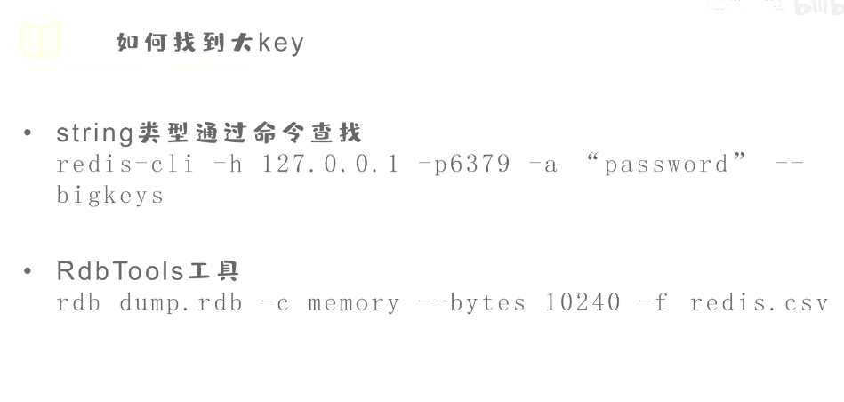
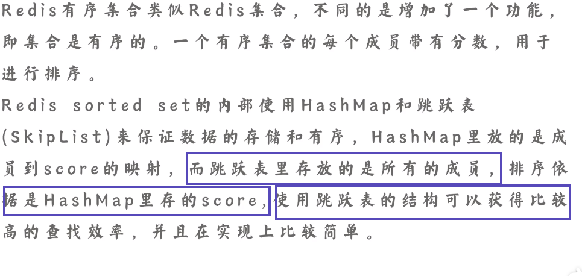

 

# redis

## 1. redis的大key怎么处理

### 什么是？

### 怎么找

怎么删

## 2. 什么是缓存穿透

### 怎么处理

## 3.Redis脑裂问题产生原因及解决方式

现象和原因

危害

怎么解决

## 4.如何保证缓存一致性？

解决方案

推荐

删除失败的问题

## 5.Redis的LRU算法是如何实现的？

## 6.线上Redis崩溃，CPU飙升，你怎么解决？

现象

### 慢命令

## 7.Redis常见数据类型应用场景？

## 8.为什么Redis宕机数据不丢失？

## 9.Redis过期策略有哪些？（是内存淘汰算法）

