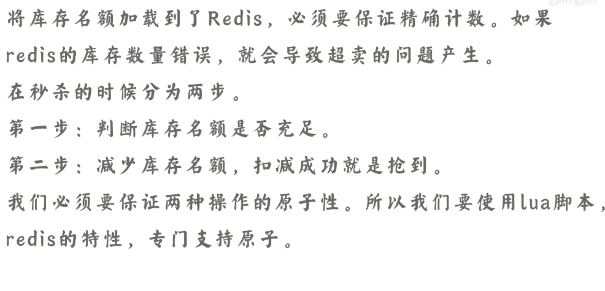
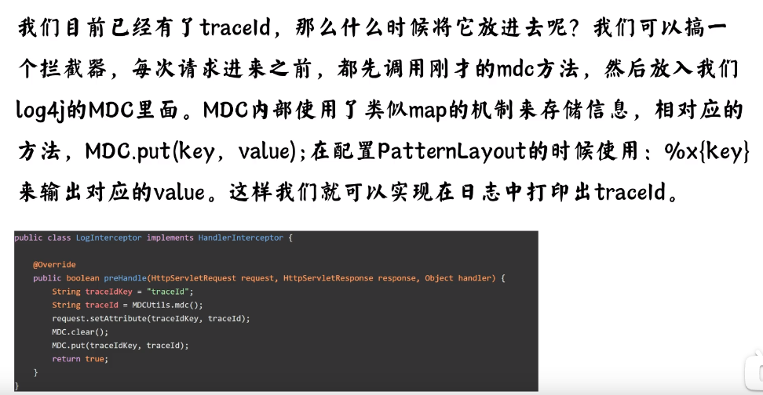

# 系统设计

## 1.秒杀系统如何解决超卖等常见问题？

### 超卖

### 少卖

## 2.如何实现30分钟内未支付则取消订单？

### 1.定时

### 2.mq

## 3.如何避免订单重复提交和支付？

这类的问题可以归结为怎么保证接口的幂等性。

### 前端处理

### token机制

### 支付幂等

## 4.你用过什么分布式id算法？最优的是哪种？

### 背景

### 算法

### 优点

### 原理

### 优化

## 5.你是如何实现限流算法的？（接口限流）

###  背景

### 计数器

### 令牌桶

### 漏桶

## 6.日志最佳实践

## 7.ElasticSearch性能优化方案？

## 8.使用TraceId实现线上问题定位！

### 背景

## 9.如何设计一个秒杀系统？

### 什么是

### 特点

### 高并发

### 超卖问题

### 限流

### 静态资源

### 前端

### 防刷子

### 后处理

### 降级

## 10.线上一亿数据，如何分表迁移？

### 背景

### 如何迁移

### 双写方案

## 11.618的商品排行榜是如何实现的

### 什么是

### 数据库实现

### 大数据

### redis

## 12.百万并发抢券业务你如何设计？

### 背景

### 问题

## 13.两个50亿的url找出相同url?这可能？

1.

2.

## 14. 十万级发券业务性能瓶颈及解决方案？

#### 1.存储瓶颈

#### 2. 失败解决问题

